# From impounded pool to river: quantifying the post-breach reorganisation of the former Kakhovka Reservoir from water-surface geometry

## ABSTRACT

**Background.** On 6 June 2023 the Kakhovka Dam was destroyed and the 2 155 km² reservoir on the lower Dnipro drained within days. Post-breach studies have described the event through water extent and exposed area. Area alone cannot say how the system reorganised: a level pool and a sloping channel can occupy the same footprint.

**Aim.** We quantify how the former reservoir reorganised after the abrupt loss of impoundment, in terms of the geometry of its water surface: the longitudinal gradient of observed water-surface elevations across the footprint (hereafter slope), their spatial heterogeneity and the connectivity of the water bodies.

**Method.** We combine twelve hydrological posts (seven long daily gauge records and five estuary posts of the 2023 sea yearbook), ICESat-2 ATL13 laser altimetry, SWOT radar interferometry, Sentinel-2 water masks and a 1970 field survey of the reservoir surface. The gauges are transformed to EVRF2019; the satellite heights are restored to the ellipsoid and reduced with the EGG2015 quasigeoid, with permanent-tide conventions handled explicitly. The two branches are compared through a measured local closure residual rather than an assumed datum transformation. Per-overpass water-surface slopes are estimated with a Theil–Sen fit; one overpass is the independent unit. Data sources of independent origin are tested against each other before interpretation, with calibration, validation and sensitivity paths kept apart.

**Results.** Before the breach the pool was near-level: median per-overpass slope +0.090 cm/km, 10 of 14 overpasses positive, consistent with the 1970 survey. After the breach every overpass carries a positive downstream gradient: median +3.314 cm/km, 14 of 14 positive; difference +3.223 cm/km (95 % CI [+1.994, +5.071] cm/km; permutation p = 1.00e-04). The gradient was already present in the first passes after drainage (July–September 2023, median +3.245 cm/km) and persists through 2025. Within-overpass water-surface heterogeneity rose from 0.117 m to 0.397 m (+0.280 m), and still by +0.166 m once a planar trend is removed from each overpass, so it is not the gradient alone. A single connected surface of 2 129 km² became a median of 503 disconnected bodies totalling 289 km². SWOT recorded the outlet through the drawdown itself: 17.6 m on 31 May, 5.7 m on 13 June (gauge-anchored frame tied to EVRF2019). Gauges, the two altimeters and the historical survey — independent sensors and cross-checks with distinct error structures, partly sharing the gauges and the quasigeoid — agree at the centimetre-to-decimetre level, the measured along-reach gradient of their closure is far smaller than the observed slope contrast, and that contrast is the same in every vertical frame tested.

**Conclusions.** We quantify the persistent reorganisation of water-surface geometry across the former Kakhovka Reservoir footprint, from the impounded to the post-drainage state. Following the abrupt loss of impoundment, the observed water surface of the >2 000 km² system changed from a near-level connected pool to a persistently downstream-sloping and fragmented one, and the new gradient was already present within weeks of depletion. The change is in the spatial organisation of the water surface, not only in its area, and it becomes measurable once gauges, satellites and legacy hydrography are placed in a common observational framework through explicit vertical reductions and an empirically validated local closure.

**Keywords:** dam breach; reservoir drawdown; hydraulic regime; water-surface slope; satellite altimetry; ICESat-2; SWOT; vertical datum; EVRF2019; Kakhovka

# 1. INTRODUCTION

## 1.1 The Kakhovka Reservoir and the 2023 dam breach

The Kakhovka Reservoir was the lowest of the Dnipro cascade. At its normal impoundment level of 16.00 m (Baltic 1977) it held 18.19 km³ over 2 155 km²; the navigation drawdown level was 14.00 m and the dead-volume level 12.7 m (original design documentation). On 6 June 2023 the dam was breached and the pool drained within days. What remained: a river running through its former bed, a set of disconnected remnant water bodies, and about two thousand square kilometres of freshly exposed sediment.

## 1.2 Why water area is not enough

Post-breach studies of the site describe the event mainly through planform quantities: water extent, exposed area and their change. Water occurrence and surface-area change have been mapped from optical imagery (Kozlova et al., 2024; Sazonenko et al., 2024; Maksymenko & Bezsonnyi, 2026), the environmental consequences catalogued (Vyshnevskyi et al., 2023; Shumilova et al., 2025), and the breach itself reconstructed hydrodynamically (Kadam et al., 2024). Equal water areas can hide different hydraulic regimes: a level pool and a sloping channel may occupy the same footprint. How a system of this size reorganises after abrupt loss of impoundment is a question about the spatial organisation of its water surface — its longitudinal slope, its heterogeneity and its connectivity — not about its area. Answering it requires elevations that are commensurable across sensors and epochs.

## 1.3 Water-surface geometry from spatial altimetry, and why the vertical reference matters

ICESat-2 photon-counting lidar and SWOT Ka-band interferometry observe water-surface elevation along tracks and across swaths, not at virtual stations. They can therefore resolve the longitudinal gradient of a reach directly (Scherer et al., 2022; Musaeus et al., 2024; Dhote et al., 2024), with dedicated tooling for ICESat-2 (Christoffersen et al., 2023) and multi-mission methods for level series (Nielsen et al., 2022). Reach-scale slope is now produced globally from ICESat-2 (Scherer et al., 2023) and mapped dynamically by SWOT (Jiang et al., 2025; Ledauphin et al., 2025; Huang & Gao, 2026). Two conditions apply. Thousands of along-track measurements from one pass must not be mistaken for independent observations. And heights reported on different ellipsoids, geoids and permanent-tide conventions must be reduced to one frame before comparison; a hydraulic model built on such elevations is only as good as that reduction (Bauer-Gottwein et al., 2023).

At Kakhovka the second condition is demanding. Gauge stages in Baltic 1977, ICESat-2 heights in a tide-free ellipsoidal system, SWOT heights with tide fields supplied but not applied, and a legacy survey reduced to an operating level are four different surfaces. The corrections between them are of the same order as the hydraulic signal sought — centimetres per kilometre over tens of kilometres. Height-datum unification is a mature discipline (Barzaghi et al., 2020; Featherstone et al., 2011; Schwabe et al., 2026; Zhang et al., 2020); the Ukrainian height system is itself in transition (Trevoho et al., 2021; Стопхай та ін., 2026); and the cost of neglecting the problem is documented — an apparent gradient produced by the levelling network rather than by the water (Penna et al., 2013). No official height reference surface for the current EVRS realization (EVRF2019) exists yet; EUREF is developing one (EUREF, 2026; BKG, 2026).

## 1.4 Aim and objectives

The aim of this study is to quantify how the former Kakhovka Reservoir reorganised after the abrupt loss of impoundment following the 2023 dam breach. Specifically, we aim to:

(i) determine how the longitudinal geometry of the water surface changed from the pre-breach impounded state to the post-breach system;

(ii) assess whether this transformation was persistent beyond the initial drawdown and accompanied by increased spatial heterogeneity and fragmentation of the water surface; and

(iii) establish a consistent observational framework by integrating gauge records, ICESat-2, SWOT and historical hydrographic observations, and test whether these data sources, independent in origin, support the same interpretation of the system's transformation.

The paper is organised accordingly. Section 2 describes the study area and data, Section 3 the methods. Section 4 presents the transformation: the pre-breach pool, the drawdown, the post-breach gradient, its persistence, and the change in heterogeneity and connectivity. Section 5 summarises the validation of the vertical reference framework on which Section 4 rests; the full validation record is in the Supplement. Section 6 discusses the result. Where the data cannot answer a question — a post-breach slope–discharge relation, a rate of bed change — we state the limitation instead of inferring an answer.

# 2. STUDY AREA AND DATA

## 2.1 Study area and observation geometry

The study system is divided into four hydro-geomorphically distinct analysis zones, arranged from upstream to downstream (Figure 1). The Reservoir zone R is the former Kakhovka Reservoir footprint upstream of the dam (2 144 km²). The Floodway zone F covers the lower Dnipro from the dam to the head of the Kherson delta, including the Inhulets confluence (2 900 km²); it is the corridor through which the June 2023 breach wave propagated. The Delta zone D comprises the distributary and floodplain system of the Kherson delta (976 km²), and the Estuary zone E the Dnipro–Buh estuary downstream of it (7 460 km²). These zones represent different hydraulic and geomorphic environments and are treated separately throughout the analysis. All four are fixed by the hydrography before any analysis: R is the pre-breach water footprint inside the full-pool outline, and F, D and E are a 10 km corridor around the water below the dam, cut at the dam, at Kherson and where the delta opens into the estuary. The zones do not overlap, so their areas are additive (13 480 km² in total). The June 2023 Sentinel-1 flood envelope is not used to define F; it is retained as an event-specific layer, 921 km² of which lies within F. Likewise, buffers used for satellite acquisition or processing are technical domains and are not treated as analysis zones. The zone geometries are frozen with their areas and content hashes in the geometry registry (identifiers R_FORMER_KAKHOVKA_RESERVOIR, F_LOWER_DNIPRO_FLOODWAY, D_KHERSON_DELTA, E_DNIPRO_BUG_ESTUARY; see Data availability) and are loaded by every script. Chainage for the reservoir profiles runs from the dam along a reservoir-axis centreline. The historical reach boundaries of the design documentation are placed on it where tie points allow; only two of five ties are usable, and reach 5 lies outside the mapped domain. SWOT's fast-sampling calibration orbit crossed the reservoir outlet and the reach below the dam daily through the breach fortnight, so the mission observed the drawdown and the flood wave as they happened. It never covered the whole pool on one date, so SWOT constrains the outlet and the downstream profile, not the reservoir-wide slope; ICESat-2 supplies the reservoir-wide slope.

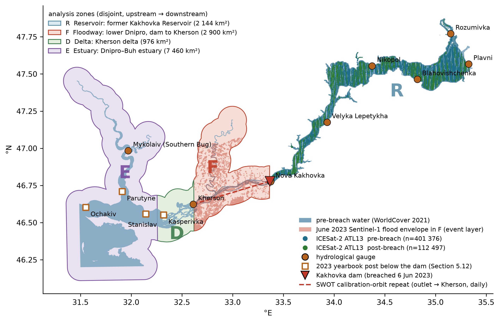

**Figure 1.** The study system. The four analysis zones in flow order — R, the former Kakhovka Reservoir; F, the lower Dnipro floodway from the dam to Kherson; D, the Kherson delta; E, the Dnipro–Buh estuary — which do not overlap; the June 2023 Sentinel-1 flood envelope within F, shown as an event layer, not a zone boundary; pre-breach water (ESA WorldCover 2021); the six reservoir gauges, Kherson and Mykolaiv (filled circles) and the four further 2023 yearbook posts below the dam (open squares); every ICESat-2 ATL13 segment used in this paper, coloured by period; and the SWOT calibration-orbit reach that the mission repeated daily through the breach fortnight.

## 2.2 Gauges and sea posts

Seven gauge records enter the vertical chain: the six reservoir gauges — Rozumivka, Plavni, Blahovishchenka, Nikopol, Velyka Lepetykha and Nova Kakhovka — which share a zero of 12.000 m BS-77, and the Kherson post 80805 at −5.000 m BS-77. Mykolaiv (98027) and the other estuary posts enter only through the 2023 sea yearbook (Section S3.9). Twelve physical posts are used in all; Table 1a gives each group, its record and its role, and the same counts are used throughout.

**Table 1a. Hydrological posts.**

| Group | Posts | Record | Role |
|---|---|---|---|
| Reservoir gauges | 6: Rozumivka, Plavni, Blahovishchenka, Nikopol, Velyka Lepetykha, Nova Kakhovka | daily, 2019–2021; Rozumivka to 2025 | ICESat-2 closure and co-variability (V1, V2); Rozumivka transfer (V3); gauge network |
| Kherson 80805 | 1 | river yearbook, daily 2019–2025; sea yearbook 2023 | local closure for every sensor (V6); breach fortnight (V7) |
| Estuary and liman posts | 5: Kasperivka, Mykolaiv, Parutyne, Stanislav, Ochakiv | sea yearbook 2023, daily means of the hourly record | breach fortnight and its propagation (V7) |
| **Total** | **12** | all carried to EVRF2019 by EPSG:9902 at their own coordinates | seven long daily records (10,194 values) + six 2023 sea-yearbook series (Kherson in both) |
 Five of the six reservoir series end on 31 December 2021. Rozumivka continues through 2025 and is the only reservoir-reach gauge record that spans the breach (921 post-breach days); Kherson likewise runs daily through 2025 (574 post-breach days). The 2023 UkrHMI yearbooks for the seas and river mouths add the estuary posts, extracted grid by grid and checked against the printed monthly statistics. At Ochakiv the breach surge appears as an annual maximum of 573 cm on 8 June. Gauge-zero provenance is documented station by station in Supplementary Table S4.

Every gauge value in this paper is a daily value, never a reading taken at the time of a satellite pass, and the daily representation differs by source. The 2019 river yearbooks give one daily value per station. From 2020 the six reservoir gauges and Kherson 80805 report the two term readings at 08:00 and 20:00 Kyiv civil time, resolved to UTC through the IANA Europe/Kyiv rules for each date; the daily gauge series used throughout is their mean, and only the ICESat-2 closure at the reservoir gauges (V1, Section S3.1) interpolates between the two bracketing term readings. The 2023 yearbook of the seas and river mouths prints daily means of the hourly record (Oleksandrivka: term values), so at Kherson the sea and river yearbooks differ by a few centimetres on some days through the averaging rule, not the datum. Where a table or caption says “daily gauge series”, it means this source-specific daily representation.

## 2.3 ICESat-2 ATL13

ATL13 Release 007 water-surface heights (`ht_water_surf`; ITRF2020, tide-free; NSIDC, 2025a) are the observation used throughout. They enter three disjoint samples that must not be confused or summed: the slope sample (14 pre-breach, 5 drawdown and 14 post-breach overpasses with a chainage span of at least 20 km), the heterogeneity sample (all ATL13 dates in the footprint: 192 pre, 23 post) and the exposed-bed sample (28 tracks).

## 2.4 SWOT

SWOT PIXC and RiverSP granules (Fu et al., 2024) over Kherson (cycles 482, 511 and 521, April–May 2023) supply the cross-sensor and gauge validation; RiverSP passes from the fast-sampling June 2023 orbit and the science orbit supply the drawdown, the downstream posts and the Rozumivka transfer test. The LakeSP archive is not used for inference: a lake-averaged product is physically wrong for a sloping, fragmenting water body. Product versions, CRIDs and reference frames are listed in Supplementary Section S1.

## 2.5 Sentinel-2 water masks

Sentinel-2 L2A scenes, processed on a 20 m registry grid (EPSG:32636) with the BOA additive offset applied, supply the coverage-gated water masks of the planform analysis; 53 dates cover the former pool.

## 2.6 Legacy hydrography

Eight photographed pages of the Dnipro reservoirs monograph (Tables 19–21, Figures 13–16) supply the design values and the 22–25 April 1970 longitudinal free-surface survey, which we use as an independent pre-breach baseline. The 7 514 chart soundings are used only to establish which reduction level they carry (Section 5.4).

## 2.7 Geodetic reference data

Two geodetic resources enter the chain. For the gauge branch: the grid `ua_2019z.asc` of the EPSG:9902 operation, distributed with the UA_KRON/NH to EVRF2019zero transformation (BKG, 2020). For the satellite branch: the EGG2015 quasigeoid (Denker, 2015), a GRS80 zero-tide height-anomaly model compatible with EVRF2007, not EVRF2019 (ISG, n.d.); we use the full-resolution 1′ × 1′ grid, not the public 10′ × 15′ release; it was provided for this study by Prof. Heiner Denker on the authors' request. The Ukrainian national quasigeoid UKG2025 (НДІГК, 2026) was not available to us as a publicly retrievable grid and is not used (Section 3.1).

**Table 1. Data sources.**

| Data source | Role in this paper | n |
|---|---|---|
| Gauges (Baltic 1977 stage series): six reservoir gauges and Kherson; Mykolaiv and four further estuary posts from the 2023 sea yearbook | Vertical anchor; temporal validation | 7 gauges + 5 sea-yearbook posts |
| ICESat-2 ATL13, slope sample (≥20 km span) | Per-overpass longitudinal slope, pre / post | 14 / 14 overpasses (+5 drawdown) |
| ICESat-2 ATL13, heterogeneity sample (all footprint dates) | Within-overpass p95–p05 range | 192 pre / 23 post dates |
| ICESat-2 ATL13/ATL08, exposed dry-bed sample | Historical datum check | 28 tracks |
| SWOT PIXC/RiverSP | Drawdown, flood wave, cross-sensor and gauge validation | 1023 PIXC–RiverSP pairs; 28 RiverSP crossings with ICESat-2 within 24 h; 67 passes at Rozumivka |
| Sentinel-2 L2A, coverage-gated water masks | Planform connectivity, pre / post | 53 dates; 1 pre / 4 post admitted |
| Legacy hydrography: 1970 free-surface survey and S-57 soundings | Pre-breach baseline; historical datum | 12 profile points; 7 514 soundings |

# 3. METHODS

## 3.1 Vertical harmonisation

Four surfaces carry the observations, and the corrections between them are of the same order as the signal. The harmonisation is therefore the method, not a preprocessing step. Its logic is short.

*Gauges* are Baltic 1977 (BS-77) normal heights above a station zero. We carry them into EVRF2019 normal heights (EPSG:9389; Sacher & Liebsch, n.d.) by the Ukrainian EPSG:9902 operation, sampling its grid at each station's own coordinates. The offset varies along the reach (0.1715 to 0.2157 m), so no single national constant is admissible. EPSG:9902 applies to the gauge branch only; it is not a quasigeoid and is never applied to satellite heights.

*Satellites* are first restored to ellipsoidal heights on the mean-tide crust, then reduced with one quasigeoid, EGG2015: H = h_MT − ζ. For ICESat-2 this means adding the product's permanent-tide term to `ht_water_surf`, as the ATL03 ATBD prescribes (Neumann et al., 2025). For SWOT it means adding back the product's own geoid height (`wse` + `geoid_hght`), so that no product geoid enters the result and the EGM2008–EGG2015 separation cancels. We call the results EGG2015-referenced heights, never EVRF2019 heights, because EGG2015 is EVRF2007-compatible, its accuracy is of the order of several centimetres (Afrasteh et al., 2021), and no EVRF2019-consistent height reference surface exists yet (EUREF, 2026; BKG, 2026). The permanent-tide conventions of each product, the sign of the ATL13 term, and every file hash are documented in Supplementary Section S1.

*Closure.* The two branches meet in one equation, written once so that the BS-77 → EVRF2019 grid Δ9902 enters exactly once:

r = (H_BS77 + Δ9902) − (h_MT − ζ_EGG2015).

The median of r over independent passes at a control point is the empirical local vertical closure residual, c = median(H_gauge − H_satellite). c is measured, not assumed. It is neither an EGG2015-to-EVRF2019 transformation nor a sensor bias: it may contain the reference-surface difference, local quasigeoid error, sensor error, gauge-zero error, reference-frame effects and collocation error, and these data cannot separate them. Where satellite heights are shown in the gauge-anchored frame tied to EVRF2019 (Section 4.2), they are H_S + c with c added as one empirical constant. The slope results of Section 4 are fitted to the EGG2015-referenced heights; no closure residual enters them (Section 5.5).

## 3.2 Chainage and per-overpass slope

Reservoir profiles use a centreline built from the reservoir polygon by principal-axis binning, with chainage from the dam; SWORD v16 is used only for the Kherson reach, the residual-body stem and channel-width transects. For every ICESat-2 overpass we regress the beam-median water-surface elevation of each of the six beams on chainage. The Theil–Sen estimator (Theil, 1992; Sen, 1968) is primary; ordinary least squares is the sensitivity check. One overpass is the independent unit (Hurlbert, 1984; Alston et al., 2022): segments and beams within a pass share the atmosphere and the water state and are never treated as replicates. The pre/post contrast uses a bootstrap on the difference of medians (Efron, 1979), a two-sided permutation test (Ernst, 2004) and a sign test, repeated at minimum spans of 10, 20, 30 and 40 km.

## 3.3 Heterogeneity, planform and historical baseline

Heterogeneity is the within-overpass p95–p05 range of water-surface elevation on all ATL13 dates in the footprint; it is not a standard deviation and not the within-profile range of the slope sample. Water masks follow a frozen NDWI/MNDWI/scene-classification rule; a coverage gate admits a date to the pre/post planform contrast only when at least 80 % of the footprint is observed. The reduction level of the S-57 soundings is tested by three independent routes (Section 5.4, Supplementary Section S4). The 1970 free-surface curve is digitised from the monograph figure and validated against the tabulated backwater profile.

## 3.4 Validation design

We test the frame before we use it. Gauge transformation and gauge–satellite closure are evaluated at every control point where a gauge and a satellite observe the same water on the same date. SWOT and ICESat-2 are compared at every crossing where an ATL13 segment falls within 200 m of a good-quality RiverSP node (node_q ≤ 1, dark fraction < 0.5) and the passes are within one day; the crossing is the independent unit. Temporal co-variability is measured on within-station anomalies, so that no closure residual can create it, with a cluster bootstrap over overpass dates; correlation is always reported alongside bias, NMAD and RMSE, never instead of them (Patidar et al., 2025). The slope result is refitted in alternative vertical frames to test its dependence on the tie. Every statistic names its independent unit. Full matching rules and estimators are in Supplementary Section S3.

The validation paths play different roles and are not statistically independent of one another. V1, the pre-breach half of V3 and V6 calibrate the closure residual c against the gauges. V2 and V7, computed on within-station anomalies, the 1970 survey and the three-route datum test of Section 5.4 are external validations that c cannot create. V4 is a cross-sensor consistency check. V8, the slope refits of Section 5.5, the EGG2015 sampling test and the track-cluster and season tests of Section 4.3 are sensitivity tests. The five data sources are independent in origin; the paths that use them are classified here so that no cross-check is read as a second independent proof.

# 4. RESULTS: THE POST-BREACH REORGANISATION

## 4.1 Before the breach: a near-level connected pool

Before the breach the impounded pool was near-level. Per-reach ICESat-2 slopes were +0.00, −0.06 and +0.06 cm/km over 0–180 km and +0.13 cm/km over 210–240 km, inside the historical discharge envelope of the design tables. The 22–25 April 1970 field-measured free-surface curve, digitised and validated against the tabulated profile (median deviation +0.022 m; NMAD 0.045 m), bounds them from above. The mean hydraulic rise over the 183 km pool was 0 cm at Qmin and 6 cm at Q20%, smaller than the documented seiche half-range at an antinode (17.5 cm) and the wind setup at an end (35 cm at 15 m/s to 148 cm at 25 m/s); even the 42 cm rise at Q1% lies inside that setup range. Centimetre-scale scatter within a pre-breach overpass is therefore physical, and the sign of the per-overpass slope before the breach was indistinguishable from chance: 10 of 14 overpasses positive (sign test p = 0.180). The apparent slope in the 180–210 km band is a chainage-geometry artefact of single overpasses, not a hydraulic signal (Supplementary Section S4).

On 5 June 2023, the last full-coverage Sentinel-2 date before the breach, the pool was one connected surface: 2 water bodies, 2 129 km², with the largest component holding 99.995 % of the water area.

## 4.2 The drawdown and the flood wave from orbit

The flood below the dam has been described from SWOT and used to test outburst-flood models (Lehnigk et al., 2026). What we add is the outlet itself, in the same vertical frame as the gauges. Heights in this section are EGG2015-referenced SWOT heights shifted by the closure residual into the gauge-anchored frame tied to EVRF2019 (H_S + c). Because the calibration orbit repeated daily over the outlet, the emptying of the pool was recorded directly: 17.6 m on 31 May, 5.7 m on 13 June 2023, a fall of 11.9 m (n = 3 SWOT nodes on the date; Table 2). Below the dam the same passes describe the wave that carried that water away: a rise of 9.10 m at 15 km (peak 10.31 m on 7 June), decaying to about two metres by 80 km. Both series are snapshots from a handful of nodes per date (1–3, some dates on a single node). We read them as a sequence of observed water surfaces, not as a hydrograph.

**Table 2. The drawdown and the flood wave, as recorded by SWOT.**

| Quantity | Value | n |
|---|---|---|
| Outlet water surface, 31 May → 13 June 2023 | 17.61 m → 5.71 m in the gauge-anchored frame tied to EVRF2019 (fall 11.90 m) | 3 SWOT nodes on the date |
| Rise above the pre-breach surface, 15 km below the dam | 9.10 m (peak 10.31 m on 2023-06-07) | 48 nodes in the bin |

*Heights are EGG2015-referenced SWOT heights shifted by the empirical closure residual into the gauge-anchored frame tied to EVRF2019 (H_S + c); they are not EVRF2019 heights in the geodetic sense. Each absolute level carries the 0.068 m grid accuracy of EPSG:9902, the closure residual and the collocation uncertainty, so the fall of 11.90 m is robust while the last centimetre of each level is not.*

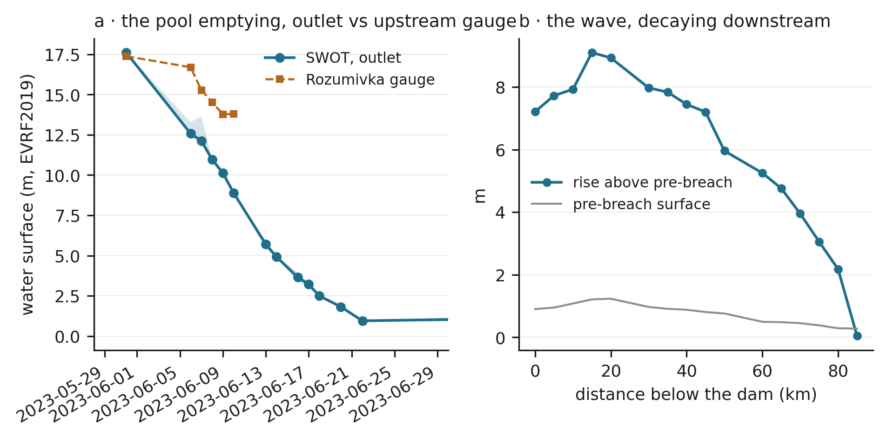

**Figure 2.** The breach fortnight from orbit. (a) Outlet water surface against the upstream gauge, 28 May – 30 June 2023, in the common vertical frame. (b) Rise above the pre-breach surface with distance below the dam.

## 4.3 After the breach: a persistent downstream gradient

The pool had drained by the end of June 2023. The first ICESat-2 overpasses over the residual system — five between 7 July and 7 September — already carry the post-breach gradient: Theil–Sen median +3.245 cm/km (n = 5). The new gradient was already present within weeks of depletion.

Across the 14 pre-breach and 14 post-breach overpasses with a chainage span of at least 20 km, the per-overpass Theil–Sen slope moved from a median of +0.090 cm/km to +3.314 cm/km. The difference is +3.223 cm/km, with a 95 % bootstrap confidence interval of [+1.994, +5.071] cm/km (permutation p = 1.00e-04; Mann–Whitney p = 3.92e-05). Every one of the 14 post-breach overpasses is positive (sign test p = 1.22e-04), against 10 of 14 before. The result is estimator-robust: ordinary least squares gives +0.038 → +2.781 cm/km, difference +2.744 cm/km (95 % CI [+1.454, +4.323]; permutation p = 3.00e-04). At a 30 km minimum span the difference is 3.202 cm/km (4 pre / 6 post); at 40 km, with three passes per period, +2.988 cm/km. Restricted to the chainage covered in both periods it is +3.235 cm/km [+1.993, +5.066], and restricted to the reference ground tracks flown in both periods +3.211 cm/km [+1.993, +5.093], so the contrast does not come from sampling different parts of the reservoir. With the same tracks in both periods, any static error in the reference surface enters both periods alike and cancels. Repeated reference ground tracks do not inflate the sample either (Hurlbert, 1984): a cluster bootstrap over the nine tracks gives +3.235 cm/km [+2.171, +5.172]; on the five tracks flown in both periods the paired post − pre medians are +2.58, +3.70, +5.13, +2.95 and +5.58 cm/km, all positive; and the contrast holds within seasons, +0.106 → +4.116 cm/km in April–October (8 pre, 10 post overpasses; 10/10 positive) and +0.090 → +2.399 cm/km in November–March (6 pre, 4 post; 4/4 positive).

Each per-overpass slope is a fit through six beam-median points over roughly 20–70 km of centreline. The claim is about the distribution of these local slopes across dates, not about a single whole-reservoir gradient, and the transition is evidenced by repetition rather than precision. The metric is a downstream-oriented gradient of water-surface elevation over every water surface the beams cross inside the footprint, channel and residual bodies alike; it deliberately differs from reach-scale river water-surface slope as defined along a hydraulically connected reach (Scherer et al., 2022; 2023), whose analogue here is the channel-restricted control of Section 4.6. An individual post-breach slope is poorly resolved: median per-pass interval half-width 21.545 cm/km, with 3 of 14 passes excluding zero individually. Before the breach the same fit is far tighter (median half-width 2.129 cm/km; 0 of 14 exclude zero), because a level surface offers no leverage for disagreement between beams, whereas a sloping, heterogeneous one does. It is the consistency of sign across every post-breach pass, not the sharpness of any one measurement, that the confidence interval summarises. That interval is not obtained by pooling within-pass point uncertainty: the observational unit is the overpass, and the inference rests on the repeated displacement of the distribution of overpass-level slopes between the two periods, so a median per-pass half-width of 21.5 cm/km is compatible with a well-resolved ensemble contrast of 3.2 cm/km.

Every post-breach overpass from January 2024 to November 2025 carries a positive slope. The 14/14 sign consistency and the effect size, not the p-value, are the evidence that the new state persists beyond the drainage transient.

**Table 3. Water-surface geometry before and after the breach.**

| Quantity | Pre → post | Uncertainty | n |
|---|---|---|---|
| Per-overpass longitudinal slope, footprint-wide (Theil–Sen median) | +0.090 → +3.314 cm/km; difference +3.223 cm/km | 95 % CI [+1.994, +5.071]; permutation p = 1.00e-04; Mann–Whitney p = 3.92e-05; positive 10/14 → 14/14 | 14 pre / 14 post |
| Slope in the first passes after drainage (7 Jul – 7 Sep 2023) | +3.245 cm/km | — | 5 |
| Slope, ordinary least squares | +0.038 → +2.781 cm/km; difference +2.744 cm/km | 95 % CI [+1.454, +4.323]; permutation p = 3.00e-04 | 14 pre / 14 post |
| Slope, 30 km minimum span | +0.112 → +3.314 cm/km; difference 3.202 | — | 4 pre / 6 post |
| Slope, channel-restricted control | difference +1.109 cm/km | 95 % CI [−0.086, +2.186]; permutation p = 0.0009; post positive 4/6 | 20 pre / 6 post |
| Per-overpass interval half-width (median) | 2.129 → 21.545 cm/km | passes excluding zero individually: 0/14 → 3/14 | 14 / 14 |
| Within-overpass heterogeneity (p95 − p05) | 0.117 → 0.397 m; difference +0.280 m | 95 % CI [+0.138, +0.367] m; permutation p = 5.00e-05; Mann–Whitney p = 1.57e-11 | 192 pre / 23 post |
| Heterogeneity with planar trend removed | 0.103 → 0.269 m; difference +0.166 m | 95 % CI [+0.119, +0.221] m; permutation p = 5e-05 | 192 pre / 23 post |
| Planform: water bodies and area | 2 bodies, 2 129 km², largest 99.995 % → median 503 bodies, 289 km², largest 58.2 % | post-breach range 161–634 bodies; largest-component fraction 31.5–80.6 % | 1 pre / 4 post dates |
| Residual water bodies relative to the channel stem | median offset −0.595 m | NMAD 0.459 m; p05 −1.19, p95 +0.51 m; 15.3 % above the stem | 678 |

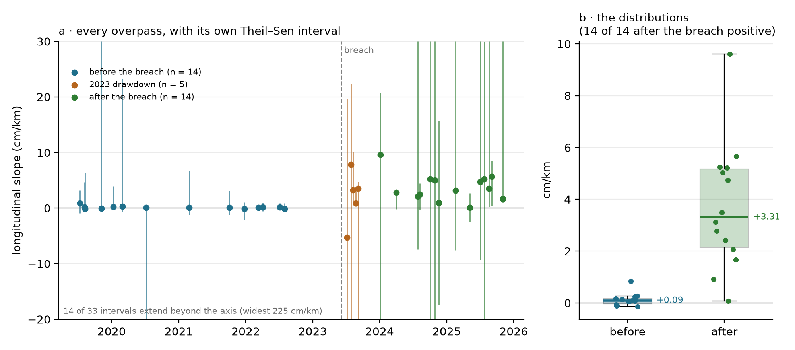

**Figure 3.** Per-overpass longitudinal slope. (a) Every overpass with the interval its own fit carries; the axis is bounded, and the count of intervals reaching beyond it is printed on the panel. (b) The two distributions. The contrast is in the ensemble, not in any single pass.

## 4.4 Increased heterogeneity of the water surface

On all ATL13 dates in the footprint, the within-overpass p95–p05 range of water-surface elevation rose from 0.117 m to 0.397 m (difference +0.280 m; 95 % CI [+0.138, +0.367] m; permutation p = 5.00e-05; Mann–Whitney p = 1.57e-11; 192 pre / 23 post). The metric is computed on the full ATL13 sample and is distinct from the slope sample. It is not independent of the gradient, because a steeper surface spreads the heights within an overpass. With a robust planar trend removed from each overpass the increase remains, smaller: 0.103 m → 0.269 m (difference +0.166 m; 95 % CI [+0.119, +0.221] m). Part of the rise in heterogeneity is the new gradient; the rest is spread about it.

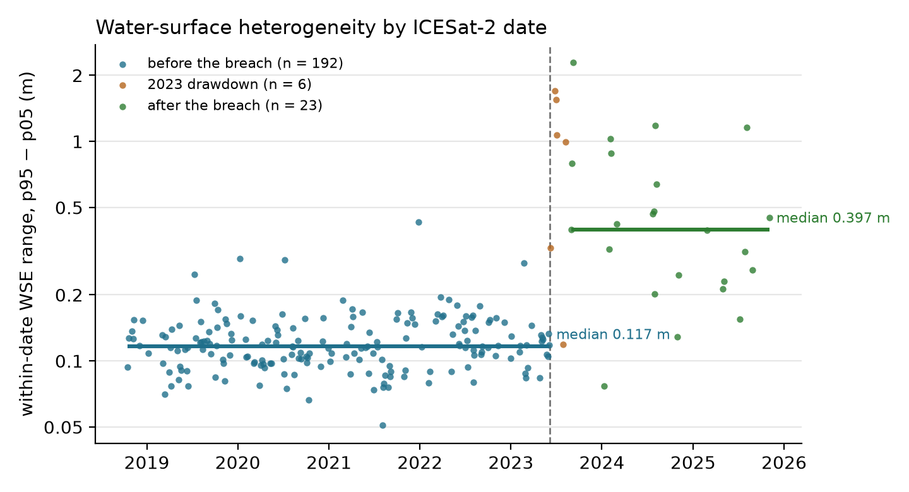

**Figure 4.** Within-overpass water-surface heterogeneity (p95 − p05) by date. Horizontal bars are period medians. The metric uses every ATL13 date in the footprint, not only those with a 20 km span.

## 4.5 Fragmentation of the water surface

The optical record documents the loss of the single connected impounded surface: from 2 water bodies and 2 129 km² on 5 June 2023, with the largest component holding 99.995 % of the water area, to a post-breach median of 503 bodies and 289 km², with the largest component holding 58.2 % (range across the four admitted dates: 161–634 bodies; 31.5–80.6 %). Component counts are corroboration rather than a measurement in their own right: only one pre-breach date has near-complete coverage, and observed connectivity scales with the observed fraction. The altimetric quantities — slope and within-overpass range — are independent of tile coverage and carry the inference. The counts also depend on the mask parameters, as any threshold-based water map does (Kirby et al., 2024). Rebuilding the masks of the five qualified dates over five NDWI/MNDWI threshold pairs, three minimum mapping units (0.02, 0.05, 0.10 km²) and with or without a 3 × 3 opening gives a post-breach median of 76–1 523 bodies and a largest-component fraction of 45–71 % in every variant that still shows the pre-breach pool as one body (largest component ≥ 99.4 %), which is every variant with NDWI thresholds up to 0.1; the frozen rule sits in the middle of that range (503 bodies, 58.2 %). The one variant that fails is NDWI > 0.2, which breaks the full pool of 5 June 2023 itself into 60–139 bodies with a largest component of 23–26 %, so it is not a usable water rule for this reservoir rather than evidence against the fragmentation. The stable statement is therefore the order of magnitude of the count and the fall of the largest-component fraction from above 99 % to about one half, not the figure 503 (`scripts/ms10_s2_fragmentation_sensitivity.py`). The remnants are perched, not connected: classified residual water bodies sit a median of 0.595 m below the adjacent channel stem (NMAD 0.459 m; 15.3 % above the stem; n = 678), consistent with disconnected remnants in depressions rather than a continuous surface.

## 4.6 The channel-restricted control

Restricting both periods to the classified main channel weakens the contrast, and its interval includes zero: Theil–Sen difference +1.109 cm/km, 95 % CI [−0.086, +2.186], on 20 pre / 6 post overpasses. The headline result is therefore a statement about the water surface within the former reservoir footprint, not strictly about the channel. The channel between the dam and Kherson also changed geometry — its wetted width on comparable dates is larger after the breach — but that result is outside the scope of this paper.

# 5. VALIDATION OF THE VERTICAL REFERENCE FRAMEWORK

Section 4 rests on heights that were reduced to one frame from four differently referenced surfaces. This section answers one question: are those heights reliable enough to interpret the observed change? The answer is yes, with the quantified limitations stated here. The full validation record — every step, every station, every processing variant — is in Supplementary Sections S1–S4 and Figures S1–S11.

## 5.1 Gauge transformation and gauge–satellite closure

All seven gauge records were carried into EVRF2019 by the official operation applied at each station's own coordinates (10,194 daily values; the offset spans 0.1715 to 0.2157 m; grid accuracy 0.068 m, EPSG registry). Against the six reservoir gauges, ICESat-2 gives a closure residual c = −0.135 m, the mean of the six station medians (median over all matchups −0.132 m; between-station SD 0.036 m; range 0.087 m; 53 pre-breach matchups on 30 dates). Each station's residual is well determined (within-station NMAD 0.034–0.06 m), and a withheld gauge is predicted from the others with RMSE 4.0 cm. At Kherson the loop closes to within a few centimetres with every sensor and product: SWOT RiverSP c = +1.3 cm [−0.7, +2.7], ICESat-2 c = −3.6 cm [−5.2, +0.1], SWOT PIXC c = −2.5 cm [−3.6, +4.6]. At Rozumivka the two closures were computed independently against the same gauge: ICESat-2 before the breach gives c = −10.7 cm [−24.9, −6.3] (9 beam transects) and SWOT after it c = −14.1 cm [−19.7, −9.0] (67 passes). No statistically resolved difference between them was detected (−3.3 cm [−10.3, +6.9]). The residual is therefore local — the reservoir and Kherson intervals are disjoint — and stable within the reservoir. Its size is compatible with the one-decimetre-or-more differences EUREF reports between European gravimetric quasigeoids and levelling-based EVRS heights (EUREF, 2026), but its components cannot be separated with these data, so it is applied as one empirical constant per station and attributed to none of them.

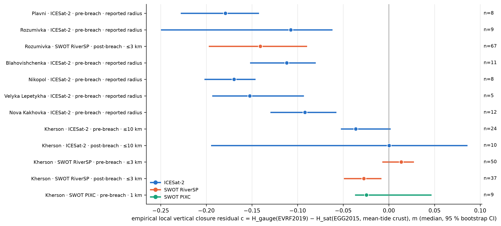

**Figure 5.** Empirical local vertical closure residuals c = gauge − satellite at the six reservoir gauges (ICESat-2, V1), at Rozumivka after the breach (SWOT RiverSP, V3) and at Kherson (V6), by sensor and period: medians with 95 % bootstrap intervals over independent units, drawn from the validation evidence table. Every reservoir station gives the same sign; at Kherson every sensor gives a residual within a few centimetres of zero.

## 5.2 Cross-sensor agreement

As a separate, system-wide consistency check, SWOT RiverSP and ICESat-2, both reduced to EGG2015, agree at the centimetre level where their passes fall within 24 h of each other across R, F, D and E: +1.4 cm [−2.4, +4.3], NMAD 7.9 cm, 68 % within ±10 cm (n = 28 crossings). The full-sample RMSE (32.5 cm) is dominated by one crossing on 6 June 2023, when a few hours of separation corresponded to a metre-scale change in level; without the breach fortnight it is 8.9 cm (NMAD 6.7 cm, n = 23), a temporal-collocation sensitivity rather than a cleaned sample. Only one of these crossings lies in R, so they characterise the system, not the reservoir, whose validation rests on the gauges (Section 5.1). As the passes move apart in time the median stays near zero while the spread grows (NMAD 13.9 cm at 1–3 d, 18.6 cm at 3–10 d), so the agreement is a statement about collocated water surfaces, not about the sensors alone. The agreement is a property of the chain: replacing SWOT's EGM2008 with EGG2015 changes the crossing differences by median 1.8 mm (max 6.8 mm, 316 crossings), and applying the ATL13 permanent-tide term with the opposite sign moves the median to −5.7 cm [−9.5, −2.9], outside the production interval. One matchup remains unresolved and is reported as such (no pass/fail criterion had been set in advance): a 5 April 2023 SWOT–gauge pair differs by −18.1 cm against an expected +5.9 cm, and the ERA5 reanalysis wind over the estuary changes in the wrong direction to explain it (Supplementary Section S3.5).

## 5.3 Temporal co-variability

Agreement in level does not show that a sensor follows the water through time. Figure 6 shows the three tests as scatter; Figure 7 shows the same levels through time. Before the breach ATL13 follows the reservoir level at the gauges on within-station anomalies, so no closure residual can create the association: r = 0.97 [0.95, 0.98], Theil–Sen slope 1.02 (110 independent overpasses). At Rozumivka, the one reservoir gauge that kept recording, SWOT after the breach follows the metre-scale swings of the new river: r = 0.98, slope 0.98 over a 3.98 m level range (67 passes, 2023-08-01 to 2025-04-25), at the same gauge that anchors the pre-breach ICESat-2 closure. Through the breach fortnight the daily SWOT orbit tracks the six posts below the dam day by day: at Kherson r = 0.998 over a 2.78 m fall (18 daily passes), at Parutyne and Mykolaiv r = 0.998 and 0.987 over a 0.93 m rise and fall (22 passes each). We read these as near-unit sensitivity to gauge-observed water-level variability, not as absolute 1:1 agreement; absolute agreement is the closure residual of Section 5.1.

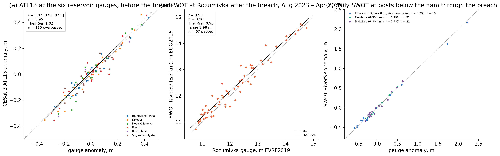

**Figure 6.** The satellites follow the water level through time. (a) ICESat-2 ATL13 against the six reservoir gauges before the breach, as within-station anomalies so that no closure residual contributes (110 overpasses; nearest gauge within 20 km). (b) SWOT RiverSP against the Rozumivka gauge after the breach, over the metre-scale swings of the new river (67 passes, nodes within 3 km); the offset from the 1:1 line is the closure residual of Figure 5. (c) The daily SWOT orbit against the posts below the dam through the breach, as anomalies: Kherson on the days only the river yearbook reports (13 June – 8 July 2023), Parutyne and Mykolaiv from 6 to 30 June 2023. Lines: 1:1 (dashed) and Theil–Sen (solid). All values from the validation evidence table.

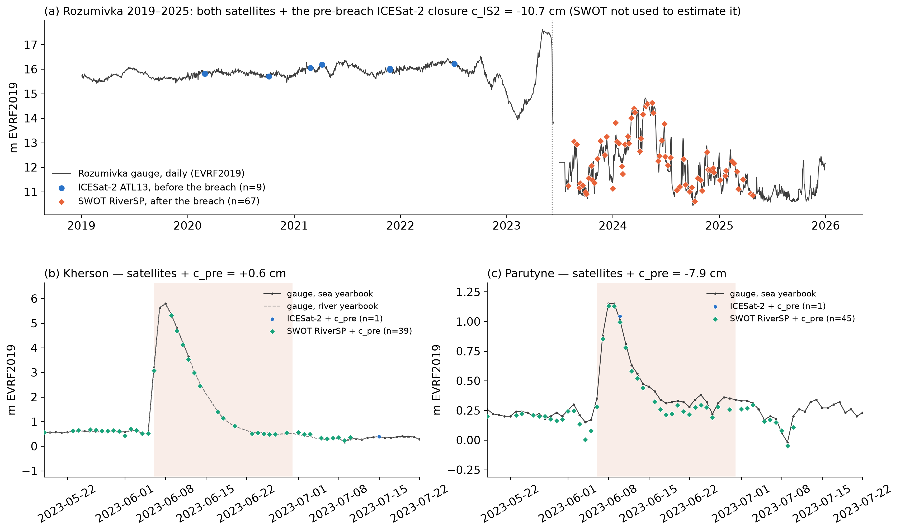

**Figure 7.** Water level through time: gauges with SWOT and ICESat-2. (a) The Rozumivka gauge 2019–2025 with ICESat-2 before the breach (9 closure matchups) and SWOT RiverSP after it (67 passes, nodes within 3 km), both shifted by the pre-breach ICESat-2 closure residual c_IS2 only; post-breach SWOT played no part in estimating it, so the lower half of the series is an out-of-period, cross-sensor transfer test. (b) Kherson and (c) Parutyne through the breach: daily gauge series (sea-yearbook daily means of the hourly record; at Kherson also the river yearbook's 08:00/20:00 term mean, dashed) and the daily SWOT orbit, shifted by each post's pre-breach SWOT closure c_pre. Shaded: 6–30 June 2023.

## 5.4 The historical baseline

The charted soundings carry no stated reduction level. Three independent routes — closure of the sounding-implied capacity curve against the published level–volume table, the elevation of the exposed bed under ICESat-2, and the published navigation drawdown level — agree that they were reduced to the 14.00 m navigation drawdown level, not the 16.00 m normal level: at 14.00 m the closure is +0.0979 m [−0.0756, +0.3028], zero inside the interval; at 16.00 m it is −1.9021 m [−2.0787, −1.6848]. Carried into EVRF2019 the level is 14.185 m (14.162 to 14.216 m). The 0.40 m spread among the three routes is an inter-method spread, the envelope of that datum's uncertainty; no formal distribution is claimed for it. The digitised 1970 free-surface curve deviates from the tabulated profile by a median of +0.022 m (NMAD 0.045 m).

## 5.5 The slope result does not depend on the vertical tie

The per-overpass slopes are fitted to EGG2015-referenced ICESat-2 heights; no gauge-derived closure residual enters them. We tested this by refitting every slope in alternative vertical frames on the same points and overpasses. Adding a constant — which is what c is — changes nothing (max |ΔS| 4e-16 cm/km). Removing the ATL13 mean-tide term changes the slopes only through its latitude dependence (max |ΔS| 0.0037 cm/km; contrast +3.222 cm/km). A closure residual varying linearly along the reach shifts every slope by exactly its gradient; the measured gradient of c along the reach is −0.020 cm/km [−0.089, +0.050], and the contrast is 36 times the largest value in that interval. The headline contrast of +3.223 cm/km is the same in every frame (Supplementary Figure S11). The quasigeoid is interpolated bilinearly throughout. Sampling it at the nearest 1′ cell instead, which puts centimetre steps between points a few hundred metres apart, changes the per-overpass slopes by a median of 0.016 cm/km before the breach and 0.025 cm/km after it; the contrast becomes +3.229 cm/km and all 14 post-breach slopes stay positive. The largest single change, 1.16 cm/km on 2024-07-27, moves a six-point Theil–Sen median across pairwise slopes and lies inside that fit's own interval [−7.4, +32.4] cm/km. The absolute level of the satellite heights in the gauge-anchored frame depends on the closure residual; the longitudinal gradient, and its change, do not.

**Table 4. Vertical consistency of the data sources, against the size of the observed change.**

| Check | Result | n |
|---|---|---|
| Gauge transformation BS-77 → EVRF2019 (EPSG:9902) | offset 0.1715 to 0.2157 m along the reach; grid accuracy 0.068 m | 7 stations, 10,194 daily values |
| SWOT RiverSP − ICESat-2, both reduced to EGG2015, passes within 24 h, R/F/D/E | +1.4 cm [−2.4, +4.3]; NMAD 7.9 cm | 28 crossings |
| Gauge − satellite closure residual c | reservoir (ICESat-2) −0.135 m, SD 0.036 m; Kherson (all sensors) within ±3 cm | 53 matchups at 6 stations; 9–50 passes at Kherson |
| Historical survey (1970) against tabulated profile | median deviation +0.022 m; NMAD 0.045 m | 12 |
| *Observed change (Section 4)* | *slope +3.223 cm/km over 20–70 km ≈ 0.6–2.3 m; heterogeneity +0.280 m* | — |

*The largest along-reach gradient of c admitted by its confidence interval is 0.089 cm/km (the edge of its 95 % interval), 36 times smaller than the slope contrast. Full tables: Supplementary Tables S1 and S2.*

# 6. DISCUSSION

## 6.1 From an impounded to a river-dominated state

Before the breach, the historical survey and the pre-breach overpasses agree: this impoundment held a near-level surface over the observed reach, with a hydraulic rise no larger than the wind setup and seiche that crossed it, and the sign of the per-overpass slope was indistinguishable from a coin flip. After depletion every overpass carries a positive downstream gradient of a few centimetres per kilometre, with metre-scale variability, from the first passes after drainage through to 2025. We read the change as a transition from a level, connected reservoir surface to a persistent downstream-oriented and fragmented water-surface elevation field. A river-like organisation of that field is our interpretation, consistent with the river-like bed geometry that Lehnigk et al. (2026) find under the former pool; it is not a measured hydraulic slope of the new channel, and the channel-restricted analysis (Section 4.6) is directionally consistent with this interpretation but not powered to isolate the hydraulic slope of the channel itself. That is a diagnosis from the observed surface, not an estimate of discharge, friction or energy slope. It applies to this reach; reservoirs and rivers in general can depart from these idealisations under backwater, unsteady flow and appreciable inflow.

Reaches released from an impoundment adjust neither uniformly nor immediately (Nichols & Viers, 2017). The measured geometric change is consistent with a process literature in which removing a hydraulic control, or imposing a drawdown of the water surface, accelerates flow and initiates incision and channel adjustment. Laboratory dam-removal experiments document rapid incision followed by erosional narrowing and later widening through migrating fronts (Cantelli et al., 2004; Cantelli et al., 2007). Field-scale levee breaches show that an imposed drawdown accelerates flow and promotes incision in the adjacent system (Nichols & Viers, 2017; Nienhuis et al., 2018). Downstream of removed or breached dams, channel form and riparian structure change over years rather than seasons (Skalak et al., 2009; Green & Westbrook, 2009). These are process analogues, not scale equivalents: the first is a flume, the second a levee rather than a reservoir dam, and none of them shows that a persistent satellite-measured gradient is a general diagnostic of release from impoundment.

## 6.2 Reorganisation, not shrinkage

The transformation is a change in the spatial organisation of the water surface, and area alone cannot describe it. Three quantities changed together. Slope: from near zero to a persistent positive gradient. Heterogeneity: a threefold rise in within-overpass range, only part of which is the gradient itself. Connectivity: one surface holding 99.995 % of the water area became several hundred bodies, the largest holding 58 %, the remnants perched a median 0.6 m below the channel stem. The planform record on its own would have shown the third change but not the first two, and only one pre-breach date has full coverage. The altimetric quantities carry the inference because they are independent of tile coverage. The three do not carry equal weight. Slope and heterogeneity are the primary, altimetric evidence; connectivity corroborates them, because its counts depend on optical coverage and on the mask parameters (Section 4.5).

## 6.3 What the observations can and cannot resolve

Each per-overpass slope is local, through six beam points; agreement between SWOT and ICESat-2 is centimetric only under close temporal collocation; a lake-averaged product cannot describe a sloping, fragmenting body. The per-overpass slopes are an independent observation that any hydraulic model of the current system must reproduce without having been calibrated on them; a post-breach slope–discharge relation, a rate of bed change and the bed itself are not measurable with these data and are stated as such.

## 6.4 The vertical frame

One official grid, one quasigeoid and an explicit tide term are the minimum, and each must be applied to an ellipsoidal height, not to a product's own geoid-referenced height. That is what lets two altimeters with different geoids and tide conventions agree at the centimetre level. What remains after the chain is closed is an empirical local closure residual, not a transformation. It is local — the reservoir and Kherson values differ — and at Rozumivka the closures of two missions from different epochs, computed independently against the same gauge, show no statistically resolved difference (−3.3 cm [−10.3, +6.9]), which is consistent with a shared local contribution and argues against a purely mission-specific explanation. Its decimetre scale in the reservoir is not inconsistent with the present European height-reference infrastructure: EUREF notes that the pan-European EGG quasigeoids include no GNSS/levelling-derived hybrid corrector surface and may differ from levelling-based EVRS heights by one decimetre or more (EUREF, 2026). A reference-surface contribution is therefore geodetically plausible, but at these gauges its share cannot be separated from gauge-zero, sensor, reference-frame and collocation effects. Independent attribution needs an EVRF2019-consistent height reference surface or colocated GNSS/levelling control, and neither existed for this study. We therefore report the residual as an empirical closure, not as a datum correction, and the hydraulic result does not use it.

## 6.5 Comparison with previous work

The post-breach Kakhovka studies cited in Section 1.2 report water occurrence, surface-area change, environmental consequences and hydrodynamic reconstructions; SWOT water-surface profiles of the flood wave and of the reach below the dam have been reported (Lehnigk et al., 2026), but not the persistent change of the longitudinal gradient across the former reservoir footprint from the impounded to the post-drainage state, which is what this study quantifies. Hydrodynamic reconstructions of the outburst attribute stage error to their terrain input and treat its vertical reference as a secondary concern rather than as a harmonised frame (Kadam et al., 2024). In the wider literature, dam removal, dam failure and rapid drawdown are established as producing a transition from impounded conditions towards channelised fluvial hydraulics, expressed through slope, velocity, shear stress and connectivity (Cantelli et al., 2004; Skalak et al., 2009; Nichols & Viers, 2017), and longitudinal water-surface slope is used as a diagnostic state variable for hydraulic regime, separable from water-surface area (Scherer et al., 2022; Jiang et al., 2025). SWOT and ICESat-2 each resolve inland water-surface geometry at the precision such a gradient requires, while reporting heights on different reference surfaces and in different permanent-tide conventions (Nielsen et al., 2022; Huang & Gao, 2026); vertical-datum choice and permanent-tide convention introduce offsets of centimetre to decimetre size that vary spatially (Featherstone et al., 2011; Mäkinen, 2021). Historical bathymetric surveys and reservoir design records can serve as independent validation targets for satellite measurements once their reduction datum is established, as they do here.

## 6.6 Implications for monitoring

The quantities that change first and persist — slope and within-overpass heterogeneity — can be derived from open satellite archives once a vertical frame is fixed. The quantities that cannot yet be derived — post-breach discharge and a rate of bed change — name the observations still needed.

## 6.7 Limitations

The channel-restricted slope control is underpowered (Theil–Sen difference +1.109 cm/km, 95 % CI [−0.086, +2.186]). The slope–discharge relation after the breach is not testable with these data. The survey epoch of the soundings is unrecorded and the Baltic realisation of the historical tables unstated. SWOT–ICESat-2 crossings within 24 h number 28 over R, F, D and E, and only one of them lies in the former reservoir, so the direct cross-sensor check characterises the system rather than the reservoir. No station wind or pressure record covers the 5 April 2023 anomaly, and the ERA5 reanalysis makes it larger rather than smaller (Section S3.5). The closure residual is measured at seven gauges, six of them before the breach only, and its components cannot be separated. The satellite branch uses EGG2015, which is EVRF2007-compatible; no EVRF2019-consistent pan-European height reference surface was available (EUREF, 2026), and the national UKG2025 grid could not be retrieved (НДІГК, 2026). The ATL13 V007 data dictionary and the ATL03 ATBD describe the application of the permanent-tide term with opposite signs; we use the ATBD convention, and the alternative changes no slope (Supplementary Section S1). The full-resolution EGG2015 grid was provided by its author on request and is not publicly released, so a reader reproducing the work must request it in the same way.

# 7. CONCLUSIONS

This study quantifies the persistent reorganisation of water-surface geometry across the former Kakhovka Reservoir footprint, from the impounded to the post-drainage state. Within the former footprint the per-overpass longitudinal slope changed from a median of +0.090 cm/km to +3.314 cm/km (difference +3.223 cm/km), with every post-breach overpass positive; the gradient was present within weeks of depletion and persists through 2025. Within-overpass heterogeneity rose from 0.117 m to 0.397 m, and on the four coverage-qualified post-breach Sentinel-2 dates the former continuous pool was represented by hundreds of disconnected water bodies. Following the abrupt loss of impoundment, the observed water surface of the >2 000 km² system thus changed from a near-level connected pool to a persistently downstream-graded and fragmented set of river and residual water surfaces. The result rests on gauges, two satellite altimeters, optical water masks and a 1970 field survey placed in a common observational framework; sensors and cross-checks with distinct error structures agree at the centimetre-to-decimetre level, the measured along-reach gradient of their closure is far smaller than the observed slope contrast, and that contrast is the same in every vertical frame tested. The same frame let the drawdown itself be read from orbit. What the data cannot yet say — a post-breach slope–discharge law, a rate of bed change — is stated as such rather than inferred.

# DATA AND CODE AVAILABILITY

**Gauge branch.** The BS-77 → EVRF2019 operation EPSG:9902 and its grid `ua_2019z.asc` are documented in the EPSG Geodetic Parameter Dataset and can be retrieved independently (production grid sha256 297440243e2e…).

**Satellite branch.** ICESat-2 ATL13 Release 007 (doi:10.5067/ATLAS/ATL13.007) is distributed by NSIDC. The SWOT collections are distributed by PO.DAAC; versions and CRIDs are listed in Supplementary Section S1. EGG2015 is documented by the International Service for the Geoid. Its public release is a 10′ × 15′ grid; the full-resolution 1′ × 1′ grid used here (sha256 933cb8372fa5…) was provided for this study by its author, Prof. Heiner Denker (Institut für Erdmessung, Leibniz Universität Hannover), on the authors' request; it is a restricted release and cannot be redistributed with this paper. EGG2015 is EVRF2007-compatible, not EVRF2019.

**National Ukrainian quasigeoid.** The technical characteristics of UKG2025 are publicly documented, but the numerical grid was not available to us through a stable, openly downloadable repository. Access runs through the national geodetic-data administrator and the national geoportal, which is closed to private users under martial law (НДІГК, 2026). UKG2025 is therefore not a dependency of this analysis; it is a desirable independent sensitivity dataset if access becomes available.

**Analysis tables.** Every number in the main text and Supplement is generated from a versioned evidence table with a claim identifier that points at the analysis snapshot; the tables and processing code are available from the authors' repository.

**Validation evidence.** The validation numbers of Sections 5 and S3 are generated by `scripts/ms7_validation_paths.py` into a row-level evidence table (`outputs/paper/validation/ms7_evidence.csv`, claim identifiers V1–V6) and a summary; `scripts/ms7d_manuscript_audit.py` regenerates every stated value from those tables and checks it against this text, and Figures 5, 6 and S1–S11 are drawn from the same tables; the wind diagnostic of Section S3.5 is produced by `scripts/ms8_wind_setup_20230405.py` from the ERA5 extract it writes beside its table, the track-cluster and season tests of Section 4.3 by `scripts/ms9_slope_sensitivity.py`, and the mask-parameter sensitivity of Section 4.5 by `scripts/ms10_s2_fragmentation_sensitivity.py`. Bootstrap intervals use 10 000 resamples seeded from the data. Satellite heights are reduced with EGG2015 interpolated bilinearly: nearest-cell sampling of the 1′ grid introduces artificial centimetre-scale steps between points about 200 m apart, which is why crossing differences must interpolate; the headline slopes are insensitive to it (Section 5.5).

**Analysis zones.** The four zones are frozen as one GeoJSON in EPSG:32636 (`outputs/paper/zones/paper1_zones_utm.geojson`), built by `scripts/ms5_paper1_zones.py` from registered source geometries only; the areas and SHA-256 content prefixes of the frozen geometries are R 2 144.0 km² (`ec8f487a9c1e9aed`); F 2 900.2 km² (`d658391e48d78e0a`); D 976.2 km² (`3e2abb99b13cab77`); E 7 460.2 km² (`05a605acde2516d2`). Pairwise overlaps are asserted below 0.001 km² and checked by an automated test against the manifest (`paper1_zones_manifest.json`), which also records the source-geometry hashes and the split of the June 2023 flood envelope across the zones.

# ACKNOWLEDGEMENTS

We thank Prof. Heiner Denker (Institut für Erdmessung, Leibniz Universität Hannover) for providing the full-resolution 1′ × 1′ EGG2015 quasigeoid grid for this study on our request.

# SUPPLEMENTARY MATERIAL

## S1. The vertical chain in full

### S1.1 Gauge branch

**Gauges.** Stages are Baltic 1977 (BS-77) normal heights above a station zero. We carry them into EVRF2019 normal heights, a zero-tide frame (EVRS/BKG, EPSG:9389; Sacher & Liebsch, n.d.), by the Ukrainian EPSG:9902 operation (IOGP, EPSG registry). We sample its grid `ua_2019z.asc` at each station's own coordinates (10,194 daily values transformed). The offset varies along the reach, 0.1715 to 0.2157 m, so no single national constant is admissible. EPSG:9902 is one of several Ukrainian BS-77 → EVRF2019 products, and the only one used here. The CRS-EU description `UA_KRON/NH to EVRF2019zero` documents an inverse-distance grid `idw_ua_2019_z.asc` (BKG, 2020). The recent national model combines the UKG2017 quasigeoid with an EVRF2019 zero-tide grid (Стопхай та ін., 2026). The 2026 national guidance describes a 1.0′ × 1.5′ BS-77 → EVRS transformation field supplied through the national geodetic-data administrator (НДІГК, 2026). We keep EPSG:9902 because it is openly registered and independently retrievable. It applies to the BS-77 gauge branch only: it is not a quasigeoid, and we never apply it to satellite ellipsoidal heights. The production grid is identified by its hash (ua_2019z.asc sha256 297440243e2e…, 3776 nodes; EGG2015 raster sha256 933cb8372fa5…).

### S1.2 Satellite branch and permanent-tide conventions

**Satellites.** We reduce both altimeters with the EGG2015 quasigeoid (Denker, 2015; Denker, 2013), the latest pan-European gravimetric quasigeoid of the EGG series. It is a GRS80, zero-tide height-anomaly model ζ, vertically compatible with EVRF2007 (ISG, n.d.). It is not an EVRF2019 realization. We therefore call the heights H = h − ζ "EGG2015-referenced heights" throughout, never "EVRF2019 heights". The absolute uncertainty of EGG2015 has been estimated at the centimetre level (Denker et al., 2018). Its link to EVRS, however, is a single continental parameter fitted to the EUVN-DA GNSS/levelling set, with no GNSS/levelling corrector surface, and its differences from levelling heights can reach one decimetre or more at continental scale (EUREF, 2026). Because ζ is zero-tide, we first bring every crustal height to the mean-tide crust, which for crustal heights coincides with the zero-tide crust (Mäkinen, 2021; Mäkinen & Ihde, 2008; Ihde et al., 2017).

- ICESat-2 ATL13 `ht_water_surf` is an ellipsoidal height in the tide-free system: the solid-Earth tide correction subtracted in ATL03 includes the permanent crustal deformation (Neumann et al., 2025, §6.3.3). We restore the permanent part with the product term `segment_tide_earth_free2mean` = 0.06029 − 0.180873 sin²φ, the IERS permanent radial displacement, mean-tide minus tide-free crust (Petit & Luzum, 2010, eq. 7.14a). We add it, as the ATL03 ATBD prescribes (h_ph,mean-tide = h_ph + tide_earth_free2mean; Neumann et al., 2025, §6.3.3.1): h_MT = ht_water_surf + segment_tide_earth_free2mean, and H = h_MT − ζ. The ATL13 V007 data dictionary describes the same variable with the words "subtract value from ht_water_surf" (NSIDC, 2025b). That wording contradicts the ATBD the dictionary cites as its source, the IERS definition and the stored values, so we follow the ATBD. We checked the stored values on the release used: native ATL13 v007 segment_tide_earth_free2mean against 0.06029 − 0.180873 sin²φ gives max |diff| 0.0015 mm over 10086 segments; native median −0.0382 m. The term is negative at these latitudes: the mean-tide crust lies below the tide-free crust, as the IERS displacement requires. Section S3.3 tests the sign against an independent sensor. With the term added, SWOT − ICESat-2 is +1.4 cm [−2.4, +4.3]; with it omitted, −2.1 cm [−5.9, +0.7]. Applying it with the opposite sign would raise every ICESat-2 height by twice the term (6.8–7.8 cm) and move that median to −5.7 cm [−9.5, −2.9] (Section S1.5).

- SWOT `wse` is referenced to EGM2008 (Pavlis et al., 2012), and each record ships the geoid height it subtracted (`geoid_hght`). The solid-Earth tide it removes excludes the permanent part, so the crust is mean-tide. We first restore the height to SWOT's own ellipsoidal height, h_MT = wse + geoid_hght, and only then reduce it with the same quasigeoid, H = h_MT − ζ (Normandin et al., 2026). PIXC heights reach the same h_MT by subtracting the solid-Earth, load and pole tides that the product supplies but does not apply — never the geoid field. We show, not assume, that this chain is correct: −0.0010 m for the documented chain.

No product geoid enters the result. The chain works from ellipsoidal heights, so the separation between EGM2008 and EGG2015 cancels (Section S3.7). The permanent-tide terms are of the same order as the agreement we seek, so we state them instead of absorbing them: crust tide-free → mean-tide −3.9 to −3.4 cm; EGM2008 geoid tide-free → mean-tide −8.3 to −7.2 cm.

### S1.3 Closure residual

**Closure.** Gauges and satellites meet in one equation, written once so that the BS-77 → EVRF2019 grid Δ9902 enters exactly once:

r = (H_BS77 + Δ9902) − (h_MT − ζ_EGG2015).

The median of r over the independent passes at a control point is the **empirical local vertical closure residual**, c = median(H_G^EVRF2019 − H_S^EGG2015), with G the gauge and S the satellite. Every table, figure and caption uses the sign convention gauge − satellite: a negative c means the satellite surface lies above the gauge surface. c is the empirical closure between the EVRF2019-referenced gauge branch and the EGG2015-referenced satellite branch. It is neither an EGG2015-to-EVRF2019 transformation nor a direct estimate of satellite bias. Conceptually it may contain the difference between the EVRF2007-compatible EGG2015 reference surface and the EVRF2019 realization, local quasigeoid error, satellite measurement error, gauge-zero uncertainty, terrestrial-reference-frame effects, and spatial and temporal collocation error:

c = Δ_reference + ε_quasigeoid + ε_sensor + ε_gauge-zero + ε_frame + ε_space + ε_time.

The decomposition is conceptual only. Satellite–gauge observations alone do not identify its terms. Where we show satellite heights in the gauge-anchored frame tied to EVRF2019 (Section 4.2, Figures S7 and S9), they are H_S + c, with c added as one empirical constant and attributed to none of those causes.

### S1.4 Availability of an EVRF2019 height reference surface

**Availability of an EVRF2019 height reference surface.** At the time of this study no official pan-European height reference surface existed for converting ellipsoidal heights directly to EVRF2019 normal heights. EUREF names this an outstanding limitation and is developing the European Height Reference Surface (EHRS), consistent with EVRF2019 and ETRF2020; its GNSS/levelling control dataset (EHRS_CP) is still being collected (EUREF, 2026; BKG, 2026). We therefore use EGG2015, the most recent available pan-European quasigeoid. Ukraine's national quasigeoid UKG2025 (1.0′ × 1.5′ grid; stated accuracy ±1.5 cm; created 1 January 2026) transforms UCS-2000 ellipsoidal heights to normal heights in the national EVRS realization. Guidance approved on 4 September 2026 routes access through the national geodetic-data administrator or the national geoportal, which is closed to private users under martial law; the guidance also allows local quasigeoid files for autonomous GNSS processing (НДІГК, 2026). We could not obtain the numerical grid from a stable public repository, so UKG2025 is not part of the reproducible primary chain. It remains the preferred independent sensitivity test if the grid becomes accessible. That test would be predictive: difference the UKG2025- and EGG2015-derived heights of the same control points in a common ellipsoidal frame and compare the result with c, instead of fitting to the satellite residual.

### S1.5 Variants of the vertical chain

The production chain adds the ATL13 permanent-tide term to `ht_water_surf`, following the ATL03 ATBD (Neumann et al., 2025, §6.3.3.1) and the IERS definition of the permanent crustal displacement (Petit & Luzum, 2010, eq. 7.14a). Two variants are reported here and nowhere in the main results.

- *Term omitted* (the version first computed): reservoir, superseded upstream mean −0.173 m (median −0.170); mean-tide term applied −0.0377 m; SWOT − ICESat-2 at the 28 crossings within 24 h −2.1 cm [−5.9, +0.7] against +1.4 cm [−2.4, +4.3] for the production chain; per-overpass slopes max |ΔS| 0.0037 cm/km, contrast +3.222 cm/km.
- *Term subtracted*, the wording of the ATL13 V007 data dictionary (NSIDC, 2025b): every ICESat-2 height is 6.8–7.8 cm higher than in the production chain, twice the term.

### S1.6 Product versions and reference frames

**Table S5. SWOT collections, versions and CRIDs of every granule used, with applied and reported geophysical corrections, the permanent-tide convention of `wse`, `geoid_hght` and the reconstructed ellipsoidal height, and the ITRF2014 ↔ ITRF2020 vertical difference relative to ICESat-2 Release 007 over the study area.** (Compiled from the granule metadata of the processing snapshot.)

**Table S4. Gauge-zero provenance.** For each gauge: identifier and coordinates, primary source (yearbook or station passport), stage reference, official zero and its datum, benchmark and levelling connection, zero relocation and revision history, EPSG:9902 correction, final zero in EVRF2019, and metadata uncertainty.

## S2. The SWOT PIXC vertical chain

The documented correction chain reproduces RiverSP node heights: −0.0010 m (alternatives: +0.0720 m uncorrected, +0.1451 m sign-reversed, −23.89 m geoid subtracted; n = 1023). RiverSP derives from the same SWOT observation, so this establishes the correction chain, not independent accuracy.

## S3. Full validation record

### S3.1 Cross-sensor matching and temporal co-variability: rules and estimators

We compare SWOT and ICESat-2 wherever an ATL13 segment falls within 200 m of a SWOT RiverSP node of good quality (node_q ≤ 1, dark fraction < 0.5), across all four analysis zones, not only near gauges. The independent unit is the crossing — one ICESat-2 overpass against one SWOT pass — with node-level differences reduced by the median inside it. The primary window is |Δt| ≤ 1 day; 1–3 and 3–10 days serve as timing sensitivity. We interpolate nothing in time. Over the pool interior, where SWOT has no centreline nodes, we compare SWOT LakeSP polygons with the ICESat-2 cells (500 m) inside them. We carry the ICESat-2 cells to SWOT's geoid point by point, using the SWOT − ATL13 geoid difference measured at the river nodes. We report lake-averaged levels by size class, because they are meaningful only for level water bodies (Hamoudzadeh et al., 2024; Maubant et al., 2025).

Satellite–gauge matches are same-calendar-date joins on the daily gauge series (Section 2.2): the yearbook daily value in 2019, the mean of the 08:00 and 20:00 term readings from 2020, the sea-yearbook daily mean of the hourly record in 2023. The one exception is V1, the ICESat-2 closure at the six reservoir gauges, which uses the two term readings themselves: each is placed at its UTC epoch through the Europe/Kyiv rules of that date (an automated test checks every matchup against the nearest term, so no seasonal offset can hide an hour), and the gauge value is interpolated between the two readings that bracket the overpass. V2, V3, V6 and V7 use the daily representation; nothing else is interpolated in time. We measure temporal co-variability on within-station anomalies, so that no station closure residual can create it, with a cluster bootstrap over overpass dates. Daily gauge pairs use a moving-block bootstrap, the resampling that serially dependent hydrological series require (Önöz & Bayazit, 2012; Srinivas, 2005), and an effective-sample-size test with false-discovery-rate control. We always report correlation alongside the bias, NMAD and RMSE of the same pairs, never instead of them (Patidar et al., 2025). Correlation, response slope and closure residual are three different quantities. A Theil–Sen slope of satellite on gauge measures sensitivity to the amplitude of water-level variability, not absolute agreement. It is the primary estimator; ordinary least squares and a symmetric method-comparison estimator (Passing–Bablok) are sensitivities, because neither variable is free of error. Its 95 % interval comes from a temporal block bootstrap, because successive satellite passes are not independent hydrological states. For every station, sensor and period the agreement block is n, r, β, median residual, MAE, RMSE and NMAD.

### S3.2 The gauge network in one geodetic frame

We carry all seven gauge records into EVRF2019 by the official operation applied at each station's own coordinates, not by a national mean: 10,194 daily values transformed (the grid sampler agrees with an independent implementation to 0.000 mm). The offset is not constant along the reach: 0.1715 to 0.2157 m (spread 44 mm; grid accuracy 0.068 m, EPSG registry). A single number would have been wrong at both ends of the pool.

**Table S1. The vertical chain: each step of the harmonisation and the residual it leaves.**

| Step | Result | n |
|---|---|---|
| Gauge stages carried to EVRF2019 (EPSG:9902) | 10,194 daily values transformed | 7 |
| Spatial variation of the BS-77 → EVRF2019 offset | 0.1715 to 0.2157 m | 8 |
| SWOT PIXC correction chain against RiverSP | -0.0010 m for the documented chain | 1023 |
| SWOT against ICESat-2, best collocation | best pair 2023-05-14: +0.0036 m (dt -2.28 h, 3417 segments) | 3 |
| SWOT RiverSP against ICESat-2 over R/F/D/E, both reduced to EGG2015 (/Δt/ ≤ 24 h) | +1.4 cm [-2.4, +4.3] (NMAD 7.9 cm; 68 % within ±10 cm) | 28 crossings |
| Change in SWOT − ICESat-2 when EGG2015 replaces SWOT's EGM2008 | median 1.8 mm, max 6.8 mm | 316 crossings (≤ 10 d) |
| SWOT PIXC against the Kherson gauge, c = gauge − satellite | c = -2.5 cm [-3.6, +4.6] (NMAD 4.7 cm) | 9 |
| Empirical local vertical closure residual, six reservoir gauges (ICESat-2) | empirical local vertical closure residual -0.135 m (median -0.132), SD 0.036 m, range 0.087 m | 53 pre-breach matchups on 30 dates at 6 stations |
| EGM2008–EGG2015 reference-surface separation (cancels in the chain) | +16.1 cm (NMAD 1.4 cm; range +9.1 to +20.7 cm; planar gradient 0.37 mm/km) | 3111 SWOT node locations |
| Transfer of the reservoir closure residual to Kherson | reservoir -0.130 m [-0.184, -0.081] (n=5 stations) vs Kherson +0.0051 m [-0.0515, +0.0608] | 6 |
| Reduction level of the legacy soundings | 14.00 m: +0.0979 m [-0.0756, +0.3028], zero inside CI / 16.00 m: -1.9021 m [-2.0787, -1.6848], zero outside CI | 28 |
| Historical reference level in EVRF2019 | 14.162 to 14.216 m EVRF2019, median 14.185 m | 7514 |
| Digitised 1970 free-surface curve against Table 20 | median deviation +0.022 m; NMAD 0.045 m | 12 |
| Pre-breach ICESat-2 slopes in the impounded reach | 0-180 km: +0.00, -0.06, +0.06 cm/km; 210-240 km: +0.13 cm/km | 5 |
| Production BS-77 → EVRF2019 grid | official correction at the posts 0.216 m | — |

*Residuals are medians unless a confidence interval is given; every closure residual c is gauge − satellite. The quasigeoid raster in production (G2) is the restricted full-resolution EGG2015 grid, whose geometry we verified; access terms are given under Data availability.*

The tie to the gauges is not a confirmation of the grid, and we report the two apart. Each station's closure residual is well determined: within-station NMAD 0.034–0.06 m against a between-station SD of 0.036 m (n = 53 pre-breach matchups at 6 stations). Across the six stations, however, the residual does not follow the official transformation: −0.135 m (median −0.132), SD 0.036 m, range 0.087 m. We resolve no drift along the reach on the six points available — one per gauge, enough only to catch a gross trend: −0.016 ± 0.023 m per degree of longitude (p 0.519). All six matchup sets precede the breach: five of the six reservoir gauge records end on 31 December 2021, and at Rozumivka, the sixth, no ICESat-2 overpass falls within 10 km after the breach. Section S1 lists what the residual can contain, from the EGG2015–EVRF2019 reference-surface difference to collocation error. These data cannot separate those terms. We therefore apply the residual as one empirical constant per station and attribute it to none of them. Separating the reference-surface part would need an EVRF2019-consistent height reference surface or colocated GNSS/levelling control independent of the satellite data; this study has neither. The residuals include the ATL13 mean-tide term of Section S1; the variant without it is in Section S1.5 only.

(Figure 5 of the main text.)

### S3.3 Four validation paths, and SWOT against ICESat-2 across R, F, D and E

The vertical validation runs along four separate paths, each with its own question and independent unit, and each number below is generated from a row-level evidence table (claim identifiers V1–V5). V1, the absolute closure of ATL13 against the six reservoir gauges (53 beam transects on 30 dates), and V2, ATL13's co-variability with the gauge level (110 overpasses), are given in Sections S3.2 and S3.8. V3 tests whether the pre-breach ICESat-2 frame carries over to post-breach SWOT through one gauge, Rozumivka (Sections S3.7 and S3.8). V4, below, compares the two altimeters directly. It is a system-wide consistency check, not the reservoir's validation: of its 28 crossings one lies in R, 12 in F, 2 in D and 13 in E.

SWOT RiverSP and ICESat-2, both reduced to EGG2015 (Section S1), agree at the centimetre level where their passes fall within 24 h of each other: +1.4 cm [−2.4, +4.3] (NMAD 7.9 cm; MAE 12.7 cm; 68 % within ±10 cm; n = 28 crossings, each one ICESat-2 overpass against one SWOT pass). The RMSE, 32.5 cm, is dominated by a single crossing on 6 June 2023, when several hours of separation corresponded to a metre-scale change in level. We keep it in the primary sample and report the breach fortnight as a temporal-collocation sensitivity: without 6–20 June 2023, +1.7 cm [−1.5, +3.9], NMAD 6.7 cm, RMSE 8.9 cm (n = 23). As the passes move apart in time the median stays near zero while the spread grows: +1.1 cm, NMAD 13.9 cm (62 crossings, 1–3 d apart) and −0.9 cm, NMAD 18.6 cm (226 crossings, 3–10 d apart). The agreement is therefore a statement about collocated water surfaces, not about the sensors alone; the closest collocated pair of the Kherson pilot shows the same dependence on timing (2023-05-14: +0.0036 m; dt −2.28 h; 3417 segments).

Bias, NMAD and RMSE are the agreement metrics; correlation is supplementary and must be read with the range it spans (Figure S1). On absolute heights r = 0.99 [0.78, 1.00] (ρ = 0.96; Theil–Sen 1.00 [0.90, 1.06]; Deming 1.01; Passing–Bablok 1.01), but this is carried by an 11.5 m range and by one crossing in R: without it r = 0.84. On spatial anomalies — each height minus the median of its zone, in the zones with at least three crossings (F and E, n = 25) — r = 0.80 [0.69, 0.99] and ρ = 0.93; without the breach fortnight r = 0.97. Controlling for zone and SWORD distance, ICESat-2 remains a predictor of SWOT with coefficient 1.13 [0.84, 1.74]. The two altimeters therefore agree in level and share local variability beyond the large-scale fall of the system. Zone-specific correlations are computed only where n ≥ 10 (F, E); R and D are reported as individual pairs. This matches the behaviour reported where SWOT and ICESat-2 have been combined over lakes (Huang & Gao, 2026) and where SWOT has resolved the longitudinal structure of a reservoir surface (Ming et al., 2025). It is consistent with the product- and aggregation-dependence of SWOT accuracy against independent data (Maubant et al., 2025; Zhao et al., 2025; Neal et al., 2026).

The agreement is a property of the chain, not of the data (Figure S4b; same 28 crossings): production chain +1.4 cm [−2.4, +4.3]; ATL13 permanent-tide term omitted −2.1 cm [−5.9, +0.7]; the term applied with the opposite sign −5.7 cm [−9.5, −2.9], outside the production interval; the naive product-to-product difference wse − ht_ortho −4.6 cm [−8.8, −2.2]. The naive difference fails because the two products' geoids differ at the same nodes by +2.8 cm (SWOT geoid_hght − ATL13 geoid; NMAD 0.6 cm; 3483 nodes), not by the −7.6 cm a tide-free ATL13 geoid would imply (Figure S4a). Reducing both sensors to EGG2015 instead of to SWOT's EGM2008 changes the crossing differences by median 1.8 mm, max 6.8 mm (316 crossings), as the algebra of Section S1 requires.

LakeSP is a separate, product-specific test and is never pooled with RiverSP (V5). Over small residual water bodies (≤ 20 km²) the lake-averaged level against the median ATL13 height inside the observed polygon, same day, gives +4.9 cm [−7.2, +9.5] (NMAD 12.5 cm; n = 20 lake-overpass pairs). Over large ones a lake-averaged level is not a valid comparison (+46 cm, NMAD 152 cm; n = 24; median ICESat-2 p95–p05 inside the polygon 63 cm), as expected of a product that assigns one level to a whole sloping polygon (Hamoudzadeh et al., 2024).

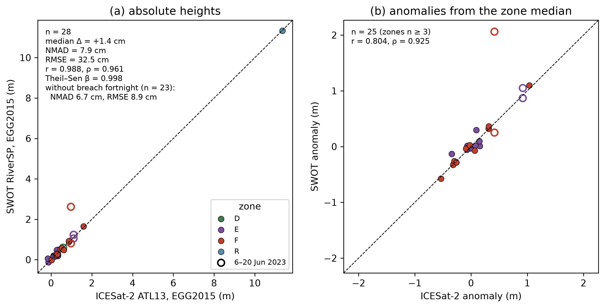

**Figure S1.** SWOT RiverSP against ICESat-2 ATL13, both in EGG2015, at the 28 crossings within 24 h over R, F, D and E. (a) Absolute heights with the 1:1 line; open markers are crossings of the breach fortnight (6–20 June 2023). (b) Anomalies from the zone median, zones with at least three crossings.

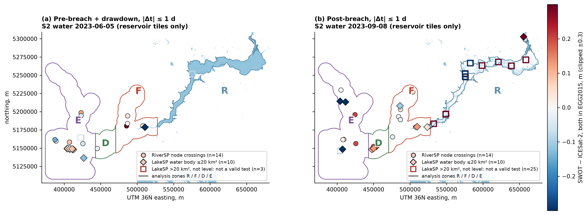

**Figure S2.** SWOT − ICESat-2 (both reduced to EGG2015) at every crossing within a day over the four analysis zones R, F, D and E: (a) before the breach and during the drawdown, on the 5 June 2023 Sentinel-2 water mask; (b) after the breach, on the 8 September 2023 mask (reservoir tiles only). Circles: RiverSP node crossings, one per ICESat-2 overpass and SWOT pass. Diamonds: small LakeSP water bodies (≤ 20 km²). Open squares: large LakeSP polygons, shown but not used as a test. Outlines: the analysis zones.

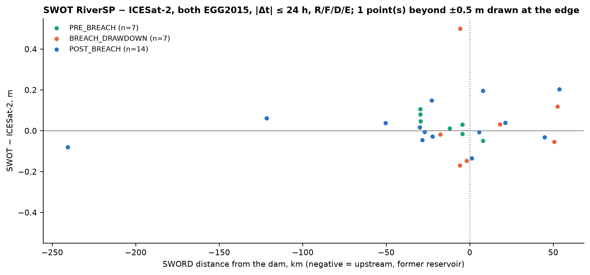

**Figure S3.** SWOT RiverSP − ICESat-2, both reduced to EGG2015, against distance from the dam along SWORD, for the 28 crossings within 24 h over R, F, D and E, by period.

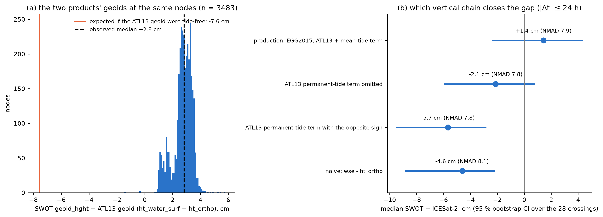

**Figure S4.** (a) SWOT `geoid_hght` minus the ATL13 geoid at the same nodes, with the offset a tide-free ATL13 geoid would imply. (b) Median SWOT − ICESat-2 at the 28 crossings within 24 h for the production chain, without the ATL13 permanent-tide term, with that term's sign reversed, and for the direct difference `wse − ht_ortho`, with 95 % bootstrap intervals.

### S3.4 Kherson as a local anchor

Against the Kherson post, the longest continuous in-situ record in the downstream reach, the SWOT PIXC branch sits within a few centimetres of the gauge: c = −2.5 cm [−3.6, +4.6] (gauge − satellite; NMAD 4.7 cm; the median moves 6.9 cm across aggregation radii 0.5–5 km; n = 9). That is the size of the gauge's own uncertainty: its two published daily series differ by about as much (Section S3.9). The agreement is local to Kherson, not evidence for the pool. Section S3.9 compares five further posts below the dam through 2023.

### S3.5 An unresolved matchup

On 5 April 2023 the observed difference is −18.1 cm; the expected value from the gauge is +5.9 cm (gauge rising +10.0 cm/day over dt 14.2 h). Applying the hydrological term makes the residual worse: −24.0 cm. No local station wind or pressure record was available. ERA5 reanalysis over the estuary indicates a reversal from setup-opposing to setup-favouring winds between the ICESat-2 and SWOT observations; the implied change is of order +5 cm and therefore has the wrong sign to explain the observed −18 cm discrepancy. The diagnostic uses the ERA5 (ECMWF) reanalysis hourly 10 m wind and sea-level pressure, retrieved through the Open-Meteo archive API and held in the repository for the Dnipro–Buh estuary ( 20 cells of 0.25° between 46.25–47.25° N and 31.5–32.25° E, 2019–2023), resolved along the estuary axis (65° from north, positive toward Kherson) and interpolated to the two epochs: the along-axis wind turned from −4.0 m/s at 07:13 UTC (ICESat-2) to +2.2 m/s at 21:26 UTC (SWOT) on the estuary mean, from −3.2 to +1.8 m/s in the cell nearest Kherson, while sea-level pressure changed by 0.0 hPa (estuary mean) and +1.4 hPa (nearest cell). A first-order setup scale, ρ_a C_D U|U| F/(ρ_w g h) with F = 60 km, h = 5 m and C_D = 1.5 × 10⁻³, converts the reversal into a rise of +5 cm (estuary mean) to +3 cm (nearest cell) at Kherson over the 14 h, the same sign as the gauge trend. Three cautions apply: ERA5 is a reanalysis at about 28 km, not a station observation; its grid stops 27 km west of the Kherson gauge, which sits in the river, where the local fetch is far shorter than the estuary's; and the scale is an order-of-magnitude diagnostic, never a correction, so no wind-derived term is subtracted from any observation (Roy et al., 2017). Wind setup therefore does not rescue the 5 April pair; it makes the anomaly larger, and the pair stays unexplained (`scripts/ms8_wind_setup_20230405.py`, `outputs/paper/validation/ms8_wind_setup_20230405.csv`). This remains a limitation.

### S3.6 Spatial limits of an empirical correction

A closure residual estimated in the reservoir does not survive the journey downstream: reservoir −0.130 m [−0.184, −0.081] (n = 5 stations) vs Kherson +0.0051 m [−0.0515, +0.0608] (station-to-station NMAD 0.033 m; radius swing 1.8 cm at Rozumivka and 5.0 cm at Kherson over 1–10 km). The two intervals are disjoint. We therefore treat the residual as local, not as a property of the sensor. Section S3.7 shows that both sensors agree on this.

### S3.7 Closing the vertical loop

Gauges, ICESat-2 and SWOT meet in the closure equation of Section S1 at every control point where a gauge and a satellite observe the same water on the same date. Table S2 lists what each sensor gives.

**Table S2. Closing the vertical loop: empirical local vertical closure residuals c (gauge − satellite) at the control points, by sensor, and the reference surfaces between them.**

| Quantity | Value | n |
|---|---|---|
| Reservoir, six gauges, ICESat-2 (mean-tide crust) | empirical local vertical closure residual -0.135 m (median -0.132), SD 0.036 m, range 0.087 m | 53 pre-breach matchups on 30 dates at 6 stations |
| Rozumivka, ICESat-2, before the breach | c = -10.7 cm [-24.9, -6.3] | 9 beam transects |
| Rozumivka, SWOT RiverSP, after the breach | c = -14.1 cm [-19.7, -9.0] (NMAD 16.6 cm) | 67 SWOT passes, 2023-08-01 to 2025-04-25, nodes ≤ 3 km |
| Rozumivka, c_SWOT − c_IS2 (both closures independent) | -3.3 cm [-10.3, +6.9] | 67 passes / 9 beam transects |
| Kherson, ICESat-2, before the breach | c = -3.6 cm [-5.2, +0.1] (NMAD 5.7 cm) | 24 overpasses, segments ≤ 10 km |
| Kherson, ICESat-2, after the breach | c = +0.0 cm [-19.4, +8.5] (NMAD 19.0 cm) | 10 overpasses from 2023-07-01 |
| Kherson, SWOT RiverSP, before the breach | c = +1.3 cm [-0.7, +2.7] (NMAD 4.7 cm) | 50 SWOT passes, nodes ≤ 3 km |
| Kherson, SWOT PIXC (1 km), before the breach | c = -2.5 cm [-3.6, +4.6] (NMAD 4.7 cm) | 9 passes |
| Kherson, SWOT RiverSP, after the breach | c = -2.7 cm [-4.9, -0.9] (NMAD 8.4 cm) | 37 SWOT passes from 2023-07-01 |
| EGM2008 (SWOT geoid_hght) − ζ EGG2015 | +16.1 cm (NMAD 1.4 cm; range +9.1 to +20.7 cm; planar gradient 0.37 mm/km) | 3111 SWOT node locations |
| BS-77 → EVRF2019 grid (EPSG:9902) across the zone | 0.188 to 0.216 m (median 0.205 m) | 3111 SWOT node locations |
| Product EGM2008 realisations compared | ATL13 geoid − SWOT geoid_hght -2.8 cm (NMAD 0.6 cm; 3483 nodes); SWOT geoid_hght − NGA EGM2008 -5.0 cm (NMAD 0.7 cm) | 3111 SWOT node locations |
| Permanent-tide terms at 46.3–47.9° N | crust tide-free → mean-tide -3.9 to -3.4 cm; EGM2008 geoid tide-free → mean-tide -8.3 to -7.2 cm | — |

*c = (H_BS77 + Δ9902) − (h_MT − ζ_EGG2015), gauge − satellite; Δ9902 enters once. c is an empirical closure residual between the EVRF2019-referenced gauge branch and the EGG2015-referenced satellite branch, not an EGG2015 → EVRF2019 transformation. It can hold a reference-surface difference, local quasigeoid error, sensor error, gauge-zero error, reference-frame effects and collocation error, and is attributed to none of them. Intervals are 95 % bootstrap intervals over independent passes. The variant without the ATL13 mean-tide term is in Section S1.5.*

Three results follow.

First, at Rozumivka the pre-breach ICESat-2 frame is tested against post-breach SWOT through the same gauge (V3). The two closures are computed independently and only then compared; nothing corrects SWOT by ICESat-2 first. ICESat-2 before the breach gives c_IS2 = −10.7 cm [−24.9, −6.3] (9 beam transects). SWOT after the breach — a different sensor, a different epoch, and a river rather than a pool — gives c_SWOT = −14.1 cm [−19.7, −9.0] (NMAD 16.6 cm; 67 passes, 2023-08-01 to 2025-04-25; RiverSP nodes within 3 km; the pass is the independent unit). No statistically resolved difference between the two was detected: c_SWOT − c_IS2 = −3.3 cm [−10.3, +6.9], with both samples resampled. An interval that contains zero is not a formal equivalence test, and we do not claim equivalence. Applying the frozen pre-breach c_IS2 to every post-breach SWOT pass without recalibration leaves a median residual of −3.3 cm [−8.9, +1.7] against the gauge. Post-breach Rozumivka is a river gauge on a sloping surface, so we report the support and slope sensitivities: within 5 km, c_SWOT = −15.4 cm (71 passes); with each pass's level taken at the gauge from a Theil–Sen fit of node WSE along SWORD distance, −15.9 cm (60 passes); within 1 km only one pass qualifies. The result is consistent with a shared local contribution and argues against a purely mission-specific explanation. It does not identify that contribution as a datum or gauge-zero effect: the two datasets share the gauge reference and the EGG2015 reduction, while sampling different epochs and hydraulic states.

Second, at Kherson the loop closes to within a few centimetres with every sensor and product: SWOT RiverSP c = +1.3 cm [−0.7, +2.7] (NMAD 4.7 cm); ICESat-2 c = −3.6 cm [−5.2, +0.1] (NMAD 5.7 cm); SWOT PIXC c = −2.5 cm [−3.6, +4.6]; SWOT RiverSP after the breach c = −2.7 cm [−4.9, −0.9] (V6). The reservoir and Kherson residuals therefore differ, as Section S3.6 found, and both sensors now agree at each end.

Third, we measure the reference surfaces between the sensors rather than assume them. The EGM2008 geoid that SWOT subtracts and the EGG2015 quasigeoid are separated by +16.1 cm (NMAD 1.4 cm; range +9.1 to +20.7 cm; planar gradient 0.37 mm/km; 3111 good SWOT node locations in R, F, D and E). This is a separation between a geoid and a quasigeoid with different model bases and tide conventions, not a misclosure of either. It cancels because we restore SWOT heights to the ellipsoid before applying ζ. The EGM2008 realisations shipped with the two products are not identical (ATL13 geoid − SWOT geoid_hght −2.8 cm, NMAD 0.6 cm, 3483 nodes; SWOT geoid_hght − NGA EGM2008 −5.0 cm, NMAD 0.7 cm), a further reason the chain does not use them. The BS-77 → EVRF2019 grid itself spans 0.188 to 0.216 m (median 0.205 m) at those nodes. Within the reservoir the closure residual is local but stable: a withheld gauge is predicted from the mean of the others with RMSE 4.0 cm (max 5.2 cm), and from the nearest other gauge along the reach with 5.9 cm. The in-sample agreement at the gauges is calibration; this leave-one-out error is the fairer measure of how well the tie transfers. The error mode that could matter for the slope result is not the size of c but its gradient along the reach, and that gradient is not resolvable: −0.020 cm/km [−0.089, +0.050] (p 0.48; ordinary least squares of the six station residuals on chainage, 0–174 km). The contrast is 36 times the largest value in the interval.

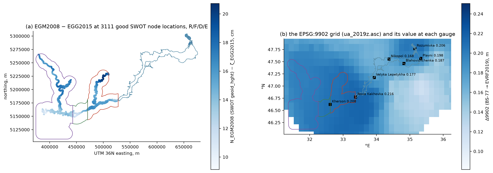

**Figure S5.** (a) N_EGM2008 (SWOT `geoid_hght`) − ζ_EGG2015 at the 3111 good SWOT node locations in R, F, D and E. (b) The EPSG:9902 grid (`ua_2019z.asc`) with its value at each gauge. Outlines: the analysis zones.

We keep the uncertainty lines separate and never combine them in quadrature: the accuracy field of the EPSG:9902 operation (spread 44 mm; grid accuracy 0.068 m, EPSG registry), which is a registry value, not a standard deviation; the EGG2015 model uncertainty (Denker et al., 2018), together with the EUREF statement that EGG–levelling differences can reach one decimetre or more at continental scale (EUREF, 2026); and the difference between the EVRF2007-compatible EGG2015 surface and the EVRF2019 realization, which we do not assume and which c may contain. Evaluating that difference independently needs an EVRF2019-consistent height reference surface or colocated GNSS/levelling control; neither was available (Section S1).

### S3.8 Temporal co-variability

Agreement in level does not show that a sensor follows the water through time, so we test co-variability separately, as gauge validations of both missions do (Kaya, 2025; Li et al., 2023; Patidar et al., 2025). Before the breach, ATL13 follows the reservoir level at the gauges: r = 0.97 [0.95, 0.98], ρ = 0.95, Theil–Sen slope 1.02 (110 independent QC-passed overpasses, each matched to the nearest reservoir gauge within 20 km of its centroid on the same date), on within-station anomalies, so the closure residuals play no part (V2). The matchup set of the closure residuals, one point per station and date, gives r = 0.96 [0.93, 0.99], ρ = 0.97, Theil–Sen slope 1.15 (30 station-dates). At Kherson, where the level range is small (0.55 m), ICESat-2 before the breach gives r = 0.88, ρ = 0.78, Theil–Sen slope 0.89 (24 overpasses, segments within 10 km). SWOT PIXC follows the Kherson gauge over its nine passes (r = 0.88, ρ = 0.88) — too few for more than description. The daily RiverSP series at Kherson follows the gauge's day-to-day changes during the recession, r = 0.98 [0.71, 1.00], ρ = 0.89 (12 consecutive-day pairs, 13 June – 8 July 2023, river yearbook), but not before the breach, when those changes are small (r = 0.16 [0.00, 0.44], ρ = 0.41; 41 pairs). Over all 59 consecutive-day pairs of 2023 the association is strongest at zero lag (r = 0.89, against 0.65 at −1 day and 0.43 at +1 day); during the smooth recession alone neighbouring days correlate almost as strongly (0.99 at zero lag, 0.97 and 0.95 at ±1 day). The lag structure therefore favours, but cannot by itself establish, same-date matching of date-only gauge records.

Station by station the picture is the same (Figure S7). Before the breach every reservoir gauge is followed by ICESat-2: r 0.91–0.98 at five gauges (14–26 overpasses each, the V2 sample). Rozumivka is the one reservoir gauge that kept recording after the breach. Rozumivka lies at the upstream tip of the reservoir, so only four overpasses fall nearer it than another gauge (r = 0.95); its nine closure matchups on six dates (2020-02-29 to 2022-07-05) give r = 0.93, and with so few this is descriptive, and Section S3.8 gives a leave-one-overpass-out sensitivity. SWOT after the breach follows the gauge through the metre-scale swings of the new river: r = 0.98, ρ = 0.96, Theil–Sen slope 0.98 over a 3.98 m level range (67 SWOT passes, 2023-08-01 to 2025-04-25; RiverSP nodes within 3 km on a sloping river; no ICESat-2 overpass falls within 10 km of Rozumivka after the breach). We read this as near-unit sensitivity to the amplitude of gauge-observed water-level variability over the sampled range, not as evidence of absolute 1:1 vertical agreement. Absolute agreement is the separate closure residual, given once per mission in Table S2. Because RiverSP nodes sample a sloping post-breach river, we evaluate its spatial-offset and along-channel slope sensitivities separately (Section S3.7).

The gauge network co-varies strongly in level but not in its daily changes: levels r 0.79–0.98 (effective n 7–58 of up to 1096 days); daily changes at the two ends r −0.65 to −0.58; mid-reservoir pair r 0.03. The two ends of the pool move in opposition about a mid-reservoir nodal line. This is consistent with the wind setup and seiche documented for this reservoir; we could not test it against wind records: no station record exists for the period, and the ERA5 extract held in the repository covers the estuary, not the reservoir (Section S3.5). The same physics makes centimetre-scale scatter within a pre-breach overpass real (Section S4). After the breach the daily changes at Rozumivka and Kherson are unrelated (r = −0.00 from July 2023; 547 day pairs).

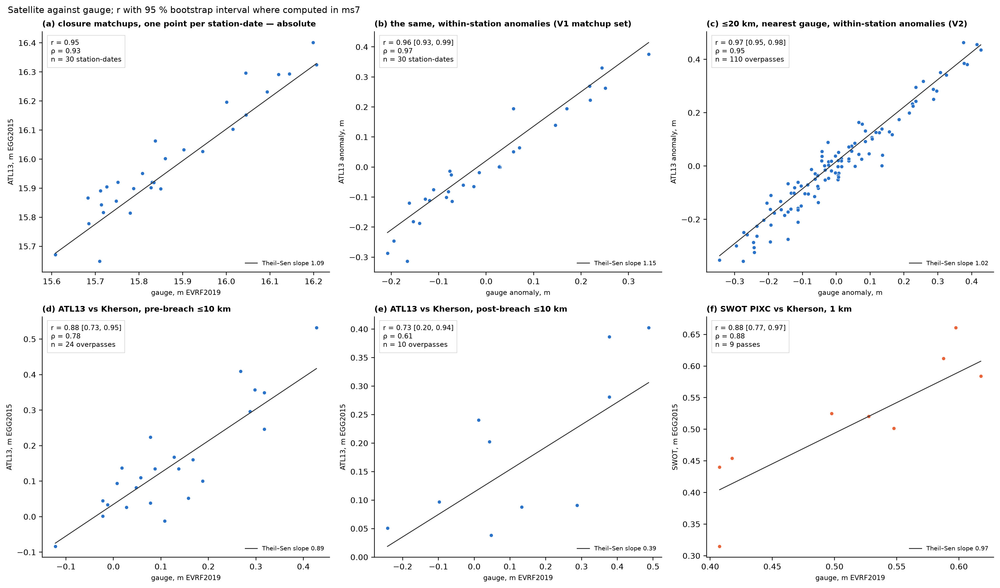

**Figure S6.** Satellite against gauge: (a, b) the closure matchups of the six reservoir gauges, one point per station and date, absolute and as within-station anomalies (V1); (c) ATL13 overpasses within 20 km of the nearest reservoir gauge, within-station anomalies (V2); (d, e) ATL13 at Kherson before and after the breach; (f) SWOT PIXC at Kherson (V6). Intervals are 95 % bootstrap intervals from the validation evidence table.

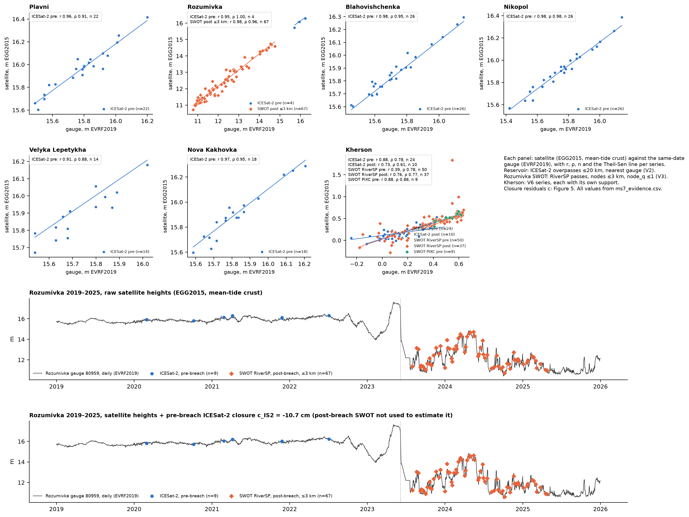

**Figure S7.** Satellite (EGG2015-referenced, mean-tide crust) against the same-date gauge (EVRF2019) at each gauge, with r, ρ, n and the Theil–Sen line per series; closure residuals are shown in Figure 5, not here. Bottom: the Rozumivka gauge 2019–2025 with ICESat-2 before the breach and SWOT RiverSP after it, first as raw EGG2015-referenced heights and then shifted by the pre-breach ICESat-2 closure residual c_IS2 (H_S + c_IS2). Post-breach SWOT was not used to estimate c_IS2; the lower panel is an out-of-period, cross-sensor transfer test.

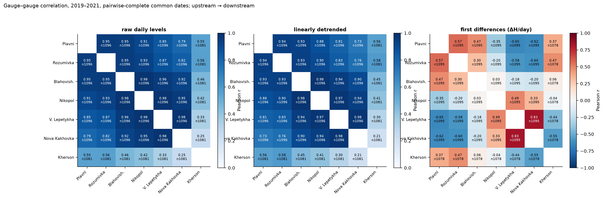

**Figure S8.** Gauge-to-gauge correlation, 2019–2021, on common daily dates: levels, detrended levels and daily changes. The daily changes at the two ends of the pool are anti-correlated.

### S3.9 The breach fortnight at the downstream posts

The fast-sampling SWOT orbit repeated daily over the reach from the dam to the estuary through June 2023. Six posts below the dam report daily mean levels (means of the hourly record; Oleksandrivka: term values) for that year in the UkrHMI yearbook of the seas and marine estuaries; none of these values is a reading at the time of the pass. Together they give the most direct test of the frame under changing water: the same chain as Section S1, every day, while the level rose and fell by metres.

The gauge side first. Kherson appears in two published daily series: the river hydrological yearbook used elsewhere in this paper, and the yearbook of the seas and marine estuaries. They differ by a median of +0.0 cm, SD 2.3 cm (NMAD 1.5 cm, max 12 cm) over 339 common days. The river yearbook alone reports 26 days, 2023-06-13 to 2023-07-08: the sea yearbook records a recorder failure (well overflow) from 6 June, flags its values for 6–12 June and gives none from 13 June to 8 July. We test the river-yearbook values for those days against SWOT: r = 0.998 over a 2.78 m fall; median +1.9 cm after applying the pre-breach closure residual, NMAD 6.4 cm (18 daily SWOT passes, 13 June – 8 July 2023). At the peak itself, on the days both yearbooks report: r = 0.999 over 2.28 m; median −8.8 cm after applying the pre-breach closure residual (NMAD 0.6 cm; 5 SWOT passes, 6–12 June 2023). The SWOT support extends 3 km along a river whose surface was falling steeply during the flood, and the gauge values on these days are flagged in the sea yearbook.

On the limans, where the flood arrived damped, SWOT records its arrival and decay day by day. Parutyne: r = 0.998 over a 0.93 m rise and fall; c −3.2 cm, NMAD 3.1 cm (22 daily SWOT passes). Mykolaiv: r = 0.987 over 0.93 m; c −3.7 cm, NMAD 5.3 cm (22 daily SWOT passes). At the liman mouth the river product is weaker: r = 0.775 over 0.66 m; c +9.4 cm, NMAD 12.0 cm. Ochakiv lies on open liman water, which the river-centreline product represents poorly.

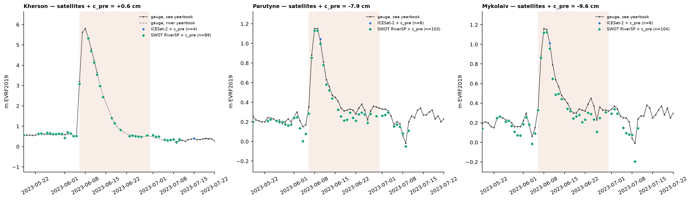

**Figure S9.** The breach fortnight at three posts below the dam: daily gauge series (sea-yearbook daily means of the hourly record; at Kherson also the river yearbook's 08:00/20:00 term mean, dashed), SWOT RiverSP (≤ 3 km) and ICESat-2 (≤ 10 km), satellites shifted by each post's pre-breach SWOT closure against the sea yearbook, c_pre (H_S + c_pre). At Kherson c_pre = +0.6 cm; the +1.3 cm of Table S2 is the same closure against the river yearbook. Shaded: 6–30 June 2023.

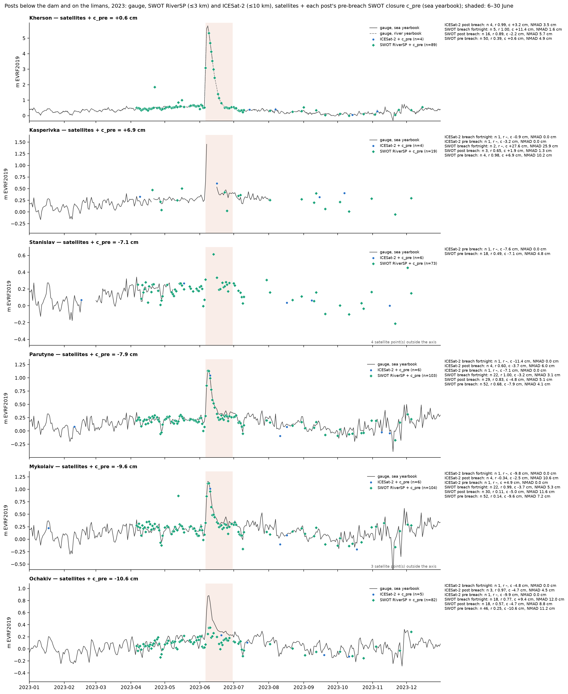

**Figure S10.** The six posts below the dam and on the limans through 2023: daily gauge series (sea-yearbook daily means of the hourly record), SWOT RiverSP (≤ 3 km; fast-sampling June orbit and science orbit) and ICESat-2 (≤ 10 km), satellites shifted by each post's c_pre, with n, r, c and NMAD per sensor and period (pre-breach, 6–30 June, from 1 July). Points beyond the axis are counted on each panel, not removed.

## S4. The historical datum and the pre-breach slopes

Testing the reduction level of the charted soundings: at 14.00 m the closure is +0.0979 m [−0.0756, +0.3028], zero inside the CI; at 16.00 m it is −1.9021 m [−2.0787, −1.6848], zero outside the CI (NMAD 0.498 m over n = 94 points). The 16.00 m assumption is rejected at ~1.90 m. That the soundings were reduced to the navigation drawdown level is our inference, corroborated by three routes; the source does not state it. Carried into EVRF2019 the level is 14.162 to 14.216 m, median 14.185 m (median offset +0.1854 m; spread 54 mm).

The digitised 1970 curve deviates from Table 20 by a median of +0.022 m (NMAD 0.045 m); in the flat pool below 180 km (n = 5) the median is +0.047 m and max |dev| 0.057 m. Pre-breach ICESat-2 slopes: 0–180 km, +0.00, −0.06, +0.06 cm/km; 210–240 km, +0.13 cm/km. All fits in the 180–210 km band are single overpasses, with a chainage span / ground span median of 1.34 (p90 1.94, max 2.65). The documented seiche and wind-setup magnitudes for this reservoir are of the same order as, or larger than, the mean hydraulic rise over the pool: mean hydraulic rise over 183 km 0 cm (Qmin), 6 cm (Q20%), 42 cm (Q1%); seiche half-range at an antinode 17.5 cm; wind setup at an end 35 cm (15 m/s) to 148 cm (25 m/s). Pre-breach scatter of several centimetres within an overpass is therefore physical.

We made six validation and consistency checks before interpreting any hydraulic result. One — the 5 April 2023 anomaly — failed, and we report it as failed. The six are not all independent: RiverSP and PIXC come from the same SWOT observation, so their agreement establishes the correction chain, not accuracy. The independent constraints are the gauge records, the 1970 field survey, and the two altimeters, which share no instrument, orbit or processing chain.

## S5. Sensitivity of the slope result

### S5.1 Sensitivity to the fitted span

At a 30 km minimum span the slope moves from 0.112 to 3.314 cm/km, difference 3.202 (n = 4 pre / 6 post). The 10 km and 20 km thresholds are not binding: the shortest fitted span in the sample is 20.3 km, so those rows repeat the headline rather than testing it. At 40 km only three passes per period remain and the difference falls to +2.988 cm/km.

The contrast does not come from sampling different parts of the reservoir before and after the breach. Restricted to the chainage covered in both periods it is +3.235 cm/km [+1.993, +5.066] (permutation p 0.0014; positive pre 7/9, post 8/8; 9 pre / 8 post overpasses). Restricted to the reference ground tracks flown in both periods it is +3.211 cm/km [+1.993, +5.093] (permutation p 0.0011; positive pre 8/11, post 8/8; 11 pre / 8 post overpasses). With the same tracks in both periods, any static error in the reference surface enters both periods alike and cancels in the difference.

### S5.2 The slope result does not depend on the vertical tie

We fit the per-overpass slopes to ICESat-2 heights reduced with EGG2015 and the ATL13 mean-tide term; no gauge-derived closure residual enters them (production heights equal the EGG2015 reduction with the mean-tide term to 4e-12 mm; the published per-overpass slopes reproduce to 4e-16 cm/km). We tested this directly, on the same points, overpasses, quality control and chainage, by refitting every slope in alternative vertical frames. Adding a constant — which is what the closure residual c is — changes nothing: max |ΔS| 4e-16 cm/km; contrast +3.223 cm/km; post-breach positive 14/14. Removing the ATL13 mean-tide term changes the slopes only through its latitude dependence: max |ΔS| 0.0037 cm/km; contrast +3.222 cm/km. Reversing its sign would change them by roughly twice that, well below a hundredth of a centimetre per kilometre, so the slope result is insensitive to how the term is applied (Section S1.5). A closure residual varying linearly along the reach shifts every slope by exactly its gradient: with the measured gradient, ΔS = 0.020 cm/km on every overpass; contrast +3.223 cm/km. The one construction that does perturb individual slopes is a piecewise-constant offset assigned from the nearest gauge — max |ΔS| 1.25 cm/km, 12 of 33 overpasses changed by more than 0.01 cm/km; contrast +3.251 cm/km; post-breach positive 13/14 — because its steps between cells enter the fit. We therefore never apply it to profile heights. The headline contrast is the same in every frame. The largest along-reach gradient of c that its confidence interval admits is about 36 times smaller than the contrast (−0.020 cm/km [−0.089, +0.050], p 0.48, the six station residuals over chainage 0–174 km). The absolute level of the satellite heights in the gauge-anchored frame depends on the closure residual; the longitudinal gradient, and its change, do not.

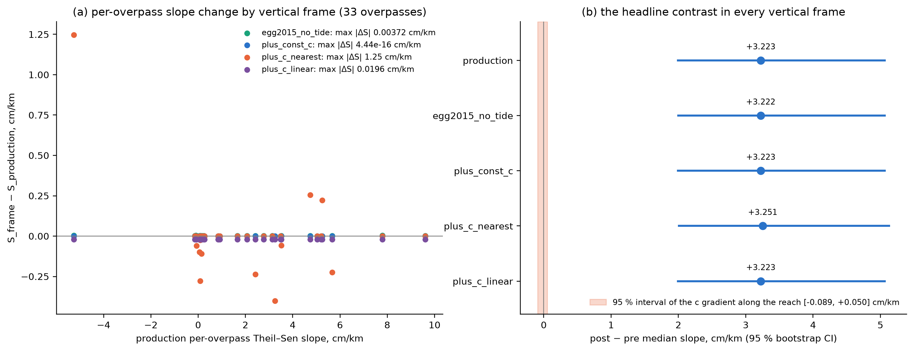

**Figure S11.** (a) Per-overpass change in the Theil–Sen slope when the heights are moved to an alternative vertical frame, against the production slope: without the ATL13 mean-tide term, with a constant offset added, and with a nearest-gauge piecewise offset added. (b) The post − pre contrast in each frame, with 95 % bootstrap intervals; the shaded band is the 95 % interval of the closure-residual gradient along the reach.

## S6. The three ICESat-2 samples

The slope, heterogeneity and exposed-bed analyses draw on different subsets of the same archive and must not be conflated. The slope sample admits an overpass only if its chainage span reaches 20 km. The heterogeneity sample takes every ATL13 date in the footprint. The exposed-bed sample is a ground-return set with no water in it at all. Sample sizes are given per claim in Tables 1, 3, S1 and S2.

# REFERENCES

- [CRS_EU_UA_KRON_EVRF2019ZERO] BKG (2020). UA_KRON / NH to EVRF2019zero — description of transformation (grid idw_ua_2019_z.asc, inverse distance weighted). CRS-EU. https://www.crs-geo.eu/crs/descrtrans/eu-descrtrans.php?crs_id=dFVBX0tST04gLyBOSA==&op_id=VUFfS1JPTiAvIE5IIHRvIEVWUkYyMDE5emVybw==&tr_one=0
- [EGG2015] Denker, H. (2015). A new European Gravimetric (Quasi)Geoid EGG2015. Poster, XXVI General Assembly of the IUGG, Prague, 22 June – 2 July 2015.
- [ISG_EGG2015] International Service for the Geoid (n.d.). EGG2015 — European Gravimetric Quasigeoid 2015: GRS80, zero-tide system, compatible with EVRF2007; public grid 10′ × 15′, full-resolution 1′ × 1′ grid via the IAG Secretary General. Accessed 23 September 2026. https://isgeoid.polimi.it/Geoid/Europe/europe2015_g.html
- [EUREF_2026_WG_CHARTER] EUREF (2026). EUREF Working Group on "European Unified Height Reference": Charter v2.1, 25 March 2026. EUREF Governing Board / BKG. https://evrs.bkg.bund.de/fileadmin/user_upload/03_EVRS/06_EVRS_References/CharterDraft_EUREF_WG.pdf
- [BKG_2026_EHRS] BKG (2026). EUREF Working Group "European Unified Height Reference" — tasks, European Height Reference Surface (EHRS) and EHRS_CP status. Bundesamt für Kartographie und Geodäsie. Accessed 23 September 2026. https://evrs.bkg.bund.de/activities/euref-working-group-european-unified-height-reference
- [NDIGK_2026_EVRS] ДП «Науково-дослідний інститут геодезії і картографії» (НДІГК) (2026). Щодо порядку використання Європейської вертикальної референцної системи EVRS: методичний документ (затв. 04.09.2026; авт. Ю. Карпінський, Р. Висотенко, І. Куриляк, О. Кучер, Д. Марченко та ін.). Київ: НДІГК. https://gki.com.ua/uk/news/vprovadzhennya-evrs-v-ukrayini-dp-ndigk-oprilyudneno-metodichniy-dokument
- [IERS_2010] Petit, G., & Luzum, B. (Eds.) (2010). IERS Conventions (2010). IERS Technical Note No. 36. Frankfurt am Main: Verlag des Bundesamts für Kartographie und Geodäsie.
- [SACHER_EVRF2019] Sacher, M., & Liebsch, G. (n.d.). EVRF2019 as new realization of EVRS. Bundesamt für Kartographie und Geodäsie. https://evrs.bkg.bund.de/fileadmin/user_upload/03_EVRS/06_EVRS_References/EVRF2019_FinalReport.pdf
- [EPSG_9902] IOGP (n.d.). EPSG Geodetic Parameter Dataset, coordinate operation 9902 «Baltic 1977 height to EVRF2019 height (1)», grid ua_2019z.asc, accuracy 0.068 m. https://epsg.io/9902
- [EVRF2019] IOGP (n.d.). EPSG Geodetic Parameter Dataset, vertical CRS 9389 «EVRF2019 height» (normal heights, zero-tide). https://epsg.org/crs_9389/EVRF2019-height.html
- [ICESAT2_ATL03_ATBD] Neumann, T. A., Hancock, D., Robbins, J., Gibbons, A., Lee, J., Brenner, A., Felikson, D., Harbeck, K., Saba, J., Luthcke, S., Rebold, T., Reese, A., & Sutterley, T. (2025). Ice, Cloud, and Land Elevation Satellite (ICESat-2) Project Algorithm Theoretical Basis Document (ATBD) for Global Geolocated Photons ATL03, Version 7 (Release 007), §6.3.3 Solid Earth Tides. ICESat-2 Project. https://doi.org/10.5067/ENBSEIJENE3U
- [ICESAT2_ATL13_V007] NSIDC (2025a). ATLAS/ICESat-2 L3A Along Track Inland Surface Water Data, Version 7 (ATL13, Release 007). NASA National Snow and Ice Data Center DAAC. https://doi.org/10.5067/ATLAS/ATL13.007
- [ICESAT2_ATL13_DD_V007] NSIDC (2025b). ATL13 Data Dictionary, Version 7 (variables ht_water_surf, segment_tide_earth_free2mean, segment_geoid). https://nsidc.org/data/documentation/atl13-data-dictionary-v07
- [STOPKHAI_2026_BS77_EVRF2019] Стопхай, Ю., Матвійчук, І., Данильчук, Д., Жолоб, О., Прищепа, С., & Чорнокнижний, О. (2026). Розроблення моделі для переходу від Балтійської системи висот 1977 р. до Європейської вертикальної референцної системи (EVRS) для території України. Сучасні досягнення геодезичної науки та виробництва, І(51), 62–67. https://doi.org/10.33841/1819-1339-1-51-62-67
- [afrasteh2021] Afrasteh, Yosra; Slobbe, D. Cornelis; Verlaan, Martin; Sacher, Martina; Klees, Roland; Guarneri, Henrique; Keyzer, Lennart; Pietrzak, Julie; Snellen, Mirjam; Zijl, Firmijn (2021). The potential impact of hydrodynamic leveling on the quality of the European vertical reference frame. *Journal of Geodesy*, 95, 90. https://doi.org/10.1007/s00190-021-01543-3
- [alston2022] Alston, Jesse M.; Fleming, Christen H.; Kays, Roland; Streicher, Jarryd P.; Downs, Colleen T.; Ramesh, Tharmalingam; Calabrese, Justin M. (2022). Mitigating pseudoreplication and bias in resource selection functions with autocorrelation-informed weighting. **. https://doi.org/10.1101/2022.04.21.489059
- [barzaghi2020] Barzaghi, Riccardo; De Gaetani, Carlo Iapige; Betti, Barbara (2020). The worldwide physical height datum project. *Rendiconti Lincei. Scienze Fisiche e Naturali*. https://doi.org/10.1007/s12210-020-00948-0
- [bauergottwein2023] Bauer-Gottwein, Peter; Zakharova, Elena; Coppo Frías, Monica; Ranndal, Heidi; Nielsen, Karina; Christoffersen, Linda; Liu, Jun; Jiang, Liguang (2023). A hydraulic model of the Amur River informed by ICESat-2 elevation. *Hydrological Sciences Journal*. https://doi.org/10.1080/02626667.2023.2245811
- [cantelli2004] Cantelli, Alessandro; Paola, Chris; Parker, Gary (2004). Experiments on upstream‐migrating erosional narrowing and widening of an incisional channel caused by dam removal. *Water Resources Research*. https://doi.org/10.1029/2003wr002940
- [cantelli2007] Cantelli, A.; Wong, M.; Parker, G.; Paola, C. (2007). Numerical model linking bed and bank evolution of incisional channel created by dam removal. *Water Resources Research*. https://doi.org/10.1029/2006wr005621
- [christoffersen2023] Christoffersen, Linda; Bauer-Gottwein, Peter; Sørensen, Louise Sandberg; Nielsen, Karina (2023). ICE2WSS; An R package for estimating river water surface slopes from ICESat-2. *Environmental Modelling &amp; Software*. https://doi.org/10.1016/j.envsoft.2023.105789
- [denker2013] Denker, Heiner (2013). Regional Gravity Field Modeling: Theory and Practical Results. *Sciences of Geodesy - II*. https://doi.org/10.1007/978-3-642-28000-9_5
- [denker2018] Denker, Heiner; Timmen, Ludger; Voigt, Christian; Weyers, Stefan; Peik, Ekkehard; Margolis, Helen S.; Delva, Pacôme; Wolf, Peter; Petit, Gérard (2018). Geodetic methods to determine the relativistic redshift at the level of 10 $$^{-18}$$ - 18 in the context of international timescales: a review and practical results. *Journal of Geodesy*. https://doi.org/10.1007/s00190-017-1075-1
- [dhote2024] Dhote, Pankaj R.; Agarwal, Ankit; Singhal, Gaurish; Calmant, Stephane; Thakur, Praveen K.; Oubanas, Hind; Paris, Adrien; Singh, Raghavendra P. (2024). River Water Level and Water Surface Slope Measurement From Spaceborne Radar and LiDAR Altimetry: Evaluation and Implications for Hydrological Studies in the Ganga River. *IEEE Journal of Selected Topics in Applied Earth Observations and Remote Sensing*. https://doi.org/10.1109/jstars.2024.3379874
- [efron1979] Efron, B. (1979). Bootstrap Methods: Another Look at the Jackknife. *The Annals of Statistics*. https://doi.org/10.1214/aos/1176344552
- [ernst2004] Ernst, Michael D. (2004). Permutation Methods: A Basis for Exact Inference. *Statistical Science*. https://doi.org/10.1214/088342304000000396
- [featherstone2011] Featherstone, W. E.; Kirby, J. F.; Hirt, C.; Filmer, M. S.; Claessens, S. J.; Brown, N. J.; Hu, G.; Johnston, G. M. (2011). The AUSGeoid09 model of the Australian Height Datum. *Journal of Geodesy*. https://doi.org/10.1007/s00190-010-0422-2
- [fu2024] Fu, Lee-Lueng; Pavelsky, Tamlin; Cretaux, Jean-François; Morrow, Rosemary; Farrar, J. Thomas; Vaze, Parag; Sengenes, Pierre; Vinogradova-Shiffer, Nadya; Sylvestre-Baron, Annick; Picot, Nicolas; Dibarboure, Gerald (2024). The Surface Water and Ocean Topography Mission: A Breakthrough in Radar Remote Sensing of the Ocean and Land Surface Water. *Geophysical Research Letters*, 51, e2023GL107652. https://doi.org/10.1029/2023GL107652
- [green2009] Green, Kim C.; Westbrook, Cherie J. (2009). Changes in riparian area structure, channel hydraulics, and sediment yield following loss of beaver dams. *Journal of Ecosystems and Management*. https://doi.org/10.22230/jem.2009v10n1a412
- [hamoudzadeh2024] Hamoudzadeh, Alireza; Ravanelli, Roberta; Crespi, Mattia (2024). SWOT Level 2 Lake Single-Pass Product: The L2_HR_LakeSP Data Preliminary Analysis for Water Level Monitoring. *Remote Sensing*. https://doi.org/10.3390/rs16071244
- [huang2026] Huang, Chi Hsiang; Gao, Huilin (2026). The Potential for Leveraging SWOT‐Mapped Uneven Water Surface Elevations to Enhance ICESat‐2–Derived Lake Levels. *Geophysical Research Letters*. https://doi.org/10.1029/2025gl119771
- [hurlbert1984] Hurlbert, Stuart H. (1984). Pseudoreplication and the Design of Ecological Field Experiments. *Ecological Monographs*. https://doi.org/10.2307/1942661
- [ihde2017] Ihde, Johannes; Sánchez, Laura; Barzaghi, Riccardo; Drewes, Hermann; Foerste, Christoph; Gruber, Thomas; Liebsch, Gunter; Marti, Urs; Pail, Roland; Sideris, Michael (2017). Definition and Proposed Realization of the International Height Reference System (IHRS). *Surveys in Geophysics*. https://doi.org/10.1007/s10712-017-9409-3
- [jiang2025] Jiang, Liguang; Nielsen, Karina; Andersen, Ole B.; Liu, Junguo (2025). SWOT Reveals Detailed Dynamics of Longitudinal River Slope in the Missouri River Basin. *Geophysical Research Letters*. https://doi.org/10.1029/2025gl115953
- [kadam2024] Kadam, Piyusha B.; Thakur, Praveen K.; Dwivedi, Sanjay K.; Garg, Vaibhav; Dhote, Pankja R. (2024). Dam Breach Analysis and Damage Assessment of Nova Kakhovka Dam using Satellite data and 1D and 2D Hydrodynamic Modeling. *The International Archives of the Photogrammetry, Remote Sensing and Spatial Information Sciences*. https://doi.org/10.5194/isprs-archives-xlviii-3-2024-251-2024
- [kaya2025] Kaya, Yunus (2025). Evaluation of ICESat-2 Laser Altimetry for Inland Water Level Monitoring: A Case Study of Canadian Lakes. *Water*. https://doi.org/10.3390/w17071098
- [kirby2024] Kirby, Katherine; Ferguson, Sarah; Rennie, Colin D.; Cousineau, Julien; Nistor, Ioan (2024). Identification of the best method for detecting surface water in Sentinel-2 multispectral satellite imagery. *Remote Sensing Applications: Society and Environment*, 36, 101367. https://doi.org/10.1016/j.rsase.2024.101367
- [kozlova2024] Kozlova, A.; Lischenko, L.; Andreiev, A.; Lubskyi, M.; Lysenko, A. (2024). Water Occurrence Mapping of Kakhovka Reservoir after the Dam Destruction. *International Conference of Young Professionals «GeoTerrace-2024»*. https://doi.org/10.3997/2214-4609.2024510066
- [ledauphin2025] Ledauphin, T.; Garambois, P.‐A.; Larnier, K.; Azzoni, M.; Emery, C.; Picot, N.; Amzil, S.; Fjørtoft, R.; Maxant, J.; Yésou, H. (2025). Assessing SWOT's Hydraulic Visibility on the Rhine: Precision Flow Lines and Slope‐Based Flood Wave Propagation Signatures. *Earth and Space Science*. https://doi.org/10.1029/2025ea004309
- [lehnigk2026] Lehnigk, K. E.; Pavelsky, T. M.; Lang, K. A. (2026). SWOT Satellite Observations of the Kakhovka Dam Break Flood Highlight Limitations of Outburst Flood Models. *Geophysical Research Letters*. https://doi.org/10.1029/2025gl120832
- [li2023] Li, Renfei; Tian, Xiangxi; Shan, Jie (2023). Validation of the Icesat-2 Lake Water Level Product. *IGARSS 2023 - 2023 IEEE International Geoscience and Remote Sensing Symposium*. https://doi.org/10.1109/igarss52108.2023.10281921
- [makinen2008] Mäkinen, Jaako; Ihde, Johannes (2008). The Permanent Tide In Height Systems. *International Association of Geodesy Symposia*. https://doi.org/10.1007/978-3-540-85426-5_10
- [makinen2021] Mäkinen, Jaakko (2021). The permanent tide and the International Height Reference Frame IHRF. *Journal of Geodesy*. https://doi.org/10.1007/s00190-021-01541-5
- [maksymenko2026] Maksymenko, V. O.; Bezsonnyi, V. L. (2026). Remote sensing assessment of the spatio-temporal transformation of the Kakhovka reservoir after dam destruction using Sentinel-2 data. *Man and Environment Issues of Neoecology*. https://doi.org/10.26565/1992-4224-2026-45-07
- [maubant2025] Maubant, Louise; Dodd, Lachlan; Tregoning, Paul (2025). Assessing the Accuracy of SWOT Measurements of Water Bodies in Australia. *Geophysical Research Letters*. https://doi.org/10.1029/2024gl114084
- [ming2025] Ming, Jie; Jiang, Liguang; Ma, Donghui; Liu, Junguo (2025). SWOT Unveils the Hidden Hydrodynamics of the Three Gorges Reservoir. *Geophysical Research Letters*. https://doi.org/10.1029/2025gl118488
- [musaeus2024] Musaeus, Aske Folkmann; Kittel, Cécile Marie Margaretha; Luchner, Jakob; Frias, Monica Coppo; Bauer‐Gottwein, Peter (2024). Hydraulic River Models From ICESat‐2 Elevation and Water Surface Slope. *Water Resources Research*. https://doi.org/10.1029/2023wr036428
- [neal2026] Neal, Jeffrey C.; Chuter, Stephen J.; Archer, Leanne; Hawker, Laurence P.; Bates, Paul D.; Savage, James; Wilkinson, Hamish; Rougier, Jonathan (2026). Flood Inundation Modeling Using the Surface Water Ocean Topography Mission. *Water Resources Research*. https://doi.org/10.1029/2025wr041527
- [nichols2017] Nichols, A. L.; Viers, J. H. (2017). Not all breaks are equal: Variable hydrologic and geomorphic responses to intentional levee breaches along the lower Cosumnes River, California. *River Research and Applications*. https://doi.org/10.1002/rra.3159
- [nielsen2022] Nielsen, Karina; Zakharova, Elena; Tarpanelli, Angelica; Andersen, Ole B.; Benveniste, Jérôme (2022). River levels from multi mission altimetry, a statistical approach. *Remote Sensing of Environment*. https://doi.org/10.1016/j.rse.2021.112876
- [nienhuis2018] Nienhuis, Jaap H.; Törnqvist, Torbjörn E.; Esposito, Christopher R. (2018). Crevasse Splays Versus Avulsions: A Recipe for Land Building With Levee Breaches. *Geophysical Research Letters*. https://doi.org/10.1029/2018gl077933
- [nikoriak2026] Nikoriak, V.V.; Osypov, V.V.; Osadcha, N.M. (2026). Validation of global elevation models using ICESat-2 LiDAR data for floodplain modeling in the Ukrainian Carpathians. *Geofizicheskiy Zhurnal*. https://doi.org/10.24028/gj.v48i2.346831
- [normandin2026] Normandin, C.; Frappart, F.; Moisy, C.; Baghdadi, N.; Ygorra, B.; Bourrel, L.; Maisongrande, P.; Leroux, D.; Crétaux, J.‐F.; Wigneron, J.‐P. (2026). To Which Extent the Surface Water Ocean Topography (SWOT) Mission Is Currently Able to Monitor Water Surface Elevation and Extent on the French Lakes?. *Earth and Space Science*. https://doi.org/10.1029/2025ea004655
- [onoz2012] Önöz, Bihrat; Bayazit, Mehmetcik (2012). Block bootstrap for Mann–Kendall trend test of serially dependent data. *Hydrological Processes*, 26, 3552–3560. https://doi.org/10.1002/hyp.8438
- [patidar2025] Patidar, Girish; Indu, J.; Karmakar, Subhankar (2025). Performance Assessment of Surface Water and Ocean Topography (SWOT) Mission for WSE Measurement Across India. *Geophysical Research Letters*. https://doi.org/10.1029/2025gl115804
- [pavlis2012] Pavlis, Nikolaos K.; Holmes, Simon A.; Kenyon, Steve C.; Factor, John K. (2012). The development and evaluation of the Earth Gravitational Model 2008 (EGM2008). *Journal of Geophysical Research: Solid Earth*. https://doi.org/10.1029/2011jb008916
- [penna2013] Penna, N. T.; Featherstone, W. E.; Gazeaux, J.; Bingham, R. J. (2013). The apparent British sea slope is caused by systematic errors in the levelling-based vertical datum. *Geophysical Journal International*. https://doi.org/10.1093/gji/ggt161
- [pohjankukka2017] Pohjankukka, Jonne; Pahikkala, Tapio; Nevalainen, Paavo; Heikkonen, Jukka (2017). Estimating the prediction performance of spatial models via spatial k-fold cross validation. *International Journal of Geographical Information Science*. https://doi.org/10.1080/13658816.2017.1346255
- [roy2017] Roy, Mathieu; Dolcine, Leslie; Fuamba, Musandji (2017). Error Analysis of Wind Effects on Natural Flow Estimation. *Journal of Hydrologic Engineering*. https://doi.org/10.1061/(asce)he.1943-5584.0001481
- [sazonenko2024] Sazonenko, Ye.; Pidgorodetska, L.; Kolos, L.; Fedorov, O. (2024). Analysis of Spatial and Temporal Changes in the Water Surface Area of the Kakhovka Reservoir based on Satellite Data. *International Conference of Young Professionals «GeoTerrace-2024»*. https://doi.org/10.3997/2214-4609.2024510069
- [scherer2022] Scherer, Daniel; Schwatke, Christian; Dettmering, Denise; Seitz, Florian (2022). ICESat‐2 Based River Surface Slope and Its Impact on Water Level Time Series From Satellite Altimetry. *Water Resources Research*. https://doi.org/10.1029/2022wr032842
- [scherer2023] Scherer, Daniel; Schwatke, Christian; Dettmering, Denise; Seitz, Florian (2023). ICESat-2 river surface slope (IRIS): A global reach-scale water surface slope dataset. *Scientific Data*. https://doi.org/10.1038/s41597-023-02215-x
- [schwabe2026] Schwabe, Joachim; Varbla, Sander; Ågren, Jonas; Teitsson, Hergeir; Ellmann, Artu; Liebsch, Gunter; Forsberg, René; Strykowski, Gabriel; Bilker-Koivula, Mirjam; Liepiņš, Ivars; Paršeliūnas, Eimuntas; Keller, Kristian; Omang, Ove Christian Dahl; Vestøl, Olav; Kaminskis, Jānis; Wilde-Piórko, Monika; Szelachowska, Małgorzata; Pyrchla, Krzysztof; Somla, Jarosław; Westfeld, Patrick; Hammarklint, Thomas; Olsson, Per-Anders; Förste, Christoph; Ince, E. Sinem (2026). The development of the unified Baltic Sea Chart Datum 2000 (BSCD2000) height transformation grid: an unprecedented example of height system unification based on state-of-the-art marine geoid modelling. *Journal of Geodesy*. https://doi.org/10.1007/s00190-026-02096-z
- [sen1968] Sen, Pranab Kumar (1968). Estimates of the Regression Coefficient Based on Kendall's Tau. *Journal of the American Statistical Association*. https://doi.org/10.1080/01621459.1968.10480934
- [shumilova2025] Shumilova, O.; Sukhodolov, A.; Osadcha, N.; Oreshchenko, A.; Constantinescu, G.; Afanasyev, S.; Koken, M.; Osadchyi, V.; Rhoads, B.; Tockner, K.; Monaghan, M. T.; Schröder, B.; Nabyvanets, J.; Wolter, C.; Lietytska, O.; van de Koppel, J.; Magas, N.; Jähnig, S. C.; Lakisova, V.; Trokhymenko, G.; Venohr, M.; Komorin, V.; Stepanenko, S.; Khilchevskyi, V.; Domisch, S.; Blettler, M.; Gleick, P.; De Meester, L.; Grossart, H.-P. (2025). Environmental effects of the Kakhovka Dam destruction by warfare in Ukraine. *Science*. https://doi.org/10.1126/science.adn8655
- [skalak2009] Skalak, Katherine; Pizzuto, James; Hart, David D. (2009). Influence of Small Dams on Downstream Channel Characteristics in Pennsylvania and Maryland: Implications for the Long‐Term Geomorphic Effects of Dam Removal1. *JAWRA Journal of the American Water Resources Association*. https://doi.org/10.1111/j.1752-1688.2008.00263.x
- [srinivas2005] Srinivas, V. V.; Srinivasan, K. (2005). Hybrid moving block bootstrap for stochastic simulation of multi-season streamflows. *Hydrological Processes*, 19, 2797–2812. https://doi.org/10.1002/hyp.5849
- [theil1992] Theil, Henri (1992). A Rank-Invariant Method of Linear and Polynomial Regression Analysis. *Advanced Studies in Theoretical and Applied Econometrics*. https://doi.org/10.1007/978-94-011-2546-8_20
- [trevoho2021] Trevoho, Ihor; Zablotskyi, Fedir; Piskorek, Andrzej; Dzhuman, Bohdan; Vovk, Andrii (2021). About modernization of Ukrainian height system. *Geodesy, cartography and aerial photography*. https://doi.org/10.23939/istcgcap2021.93.013
- [vyshnevskyi2023] Vyshnevskyi, Viktor; Shevchuk, Serhii; Komorin, Viktor; Oleynik, Yurii; Gleick, Peter (2023). The destruction of the Kakhovka dam and its consequences. *Water International*. https://doi.org/10.1080/02508060.2023.2247679
- [zhang2020] Zhang, Panpan; Bao, Lifeng; Guo, Dongmei; Wu, Lin; Li, Qianqian; Liu, Hui; Xue, Zhixin; Li, Zhicai (2020). Estimation of Vertical Datum Parameters Using the GBVP Approach Based on the Combined Global Geopotential Models. *Remote Sensing*. https://doi.org/10.3390/rs12244137
- [zhao2025] Zhao, Yao; Fu, Jun’e; Pang, Zhiguo; Jiang, Wei; Zhang, Pengjie; Qi, Zixuan (2025). Validation of Inland Water Surface Elevation from SWOT Satellite Products: A Case Study in the Middle and Lower Reaches of the Yangtze River. *Remote Sensing*. https://doi.org/10.3390/rs17081330

